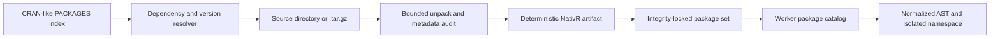

# ADR 0006: Build-time installation for pure-R packages

- Status: accepted
- Date: 2026-07-31

## Context

Reimplementing every function from every R package would discard the main benefit of a compatible
language runtime. Standard R source packages already separate metadata, namespace declarations, R
source, data, installed resources, and optional native/install-time behavior. NativR needs a general
path that reuses package-owned R code while keeping browser evaluation network-free, CSP-safe, and
independent from GNU R and webR.

The official [Writing R Extensions](https://cran.r-project.org/doc/manuals/r-release/R-exts.html)
manual defines the source-package structure and the distinction between source and installed
packages.

## Decision

Install packages at build time, not inside the browser evaluator:

`@nativr/package-tools` accepts arbitrary standard source-package input. It rejects unsafe archive
paths, links, native/JVM code, host install hooks, `LinkingTo`, `useDynLib`, and namespace forms the
loader cannot yet represent. It preserves package-owned source, license metadata, data, and `inst/`
resources in a JSON-serializable artifact with SHA-256 integrity. Packaging records a deterministic
source-platform variant, applies standard Collate ordering, and decodes portable UTF-8 or Latin-1
metadata and R sources.

The resolver follows required `Depends` and `Imports`, treats `Suggests` as optional by default,
checks package-version constraints, produces dependency-first bundles and a lock, and leaves the
runtime network-free. Repository-provided source digests are checked when present, and runtime
namespace loading independently checks version constraints again.

Admission and execution compatibility are separate. `packaging: "ready"` means the install surface
is safe to represent; `execution: "unchecked"` remains until actual namespace loading and
package-specific executable tests pass.

## Consequences

Pure-R package functions can execute without TypeScript rewrites when their language and core API
requirements are supported. Package compatibility failures become concrete diagnostics that feed
feature prioritization. Binary data conversion, broader NAMESPACE/S4 support, package tests, and
native Wasm adapters remain explicit later layers rather than hidden installer side effects.
