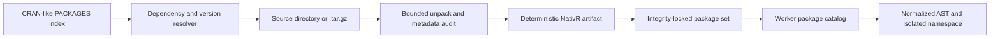

# ADR 0006: Build-time installation for pure-R packages

- Status: accepted
- Date: 2026-07-31

## Context

Reimplementing every function from every R package would discard the main benefit of a compatible
language runtime. Standard R source packages already separate metadata, namespace declarations, R
source, data, installed resources, and optional native/install-time behavior. NativR needs a general
path that reuses package-owned R code while keeping browser evaluation network-free, CSP-safe, and
independent from GNU R and webR.

The official [Writing R Extensions](https://cran.r-project.org/doc/manuals/r-release/R-exts.html)
manual defines the source-package structure and the distinction between source and installed
packages.

## Decision

Install packages at build time, not inside the browser evaluator:

`@nativr/package-tools` accepts arbitrary standard source-package input. It rejects unsafe archive
paths, links, native compilation, host install hooks, `LinkingTo`, `useDynLib`, and namespace forms
the loader cannot yet represent. JVM sources and archives may be retained as inert immutable assets
but are never compiled, loaded, or executed. It preserves package-owned source, license metadata,
data, and `inst/` resources in a JSON-serializable artifact with SHA-256 integrity. Packaging
records a deterministic source-platform variant, applies standard Collate ordering, and decodes
portable UTF-8 or Latin-1 metadata and R sources. XDR/gzip `data/*.rda` and `R/sysdata.rda` remain
unchanged package assets; the independent runtime decoder loads them into data targets or the
package namespace.

Source packages remain the canonical input. Already-installed package trees often contain
`.rdx`/`.rdb` lazy-load databases and bytecode instead of the portable R sources. A future
installed-library importer may decode that documented object-store surface, but it is not required
to avoid per-function rewrites when a source tarball is available, and it cannot bypass missing
runtime language or core API semantics.

The resolver follows required `Depends` and `Imports` and treats `Suggests` as optional by default.
Applications may explicitly select a bounded subset of names encountered through declared `Suggests`
edges or opt into the complete Suggested closure. Selected and all-Suggests modes are mutually
exclusive; undeclared names fail rather than becoming undeclared roots. Lock format v2 records the
optional-dependency mode and sorted selected names alongside dependency-first bundles. Every
admitted optional package passes the same archive, license, native-code, hook, namespace, version,
and resource audit as a required package. Repository-provided source digests are checked when
present, and runtime namespace loading independently checks version constraints again.

Admission and execution compatibility are separate. `packaging: "ready"` means the install surface
is safe to represent; `execution: "unchecked"` remains until actual namespace loading and executable
package evidence passes. P7 evidence uses an artifact-derived generic check plan over a minimal
reset/evaluate executor; the package tool does not depend on or branch inside the runtime.

The compatibility investment is therefore foundation-first: implement Base R and recommended package
semantics once, then execute package-owned R closures unchanged. A future browser-facing
`install.packages()` may orchestrate the same bounded repository resolver and artifact builder
through an explicit application capability, but it must feed this exact artifact/loader contract; it
must not introduce an ambient network client, host library tree, or package-specific evaluator.
`utils::download.file()` is reusable byte/file infrastructure for that future orchestration, not by
itself a package installer.

## Consequences

Pure-R package functions can execute without TypeScript rewrites when their language and core API
requirements are supported. Package compatibility failures become concrete diagnostics that feed
feature prioritization. Package `data/*.R` and delimited text resources now load through the normal
runtime parser and table layer; XDR/gzip `.rda` data and `R/sysdata.rda` use the bounded GNU R
serialization codec. Installed `.rdx`/`.rdb` lazy databases, broader serialized object types,
broader NAMESPACE/S4 support, package tests, and native Wasm adapters remain explicit later layers
rather than hidden installer side effects.

Top-level package tests, documentation coverage, examples, normalized saved-output comparison, and
prebuilt vignette discovery are now explicit generic package-check stages. Source-only vignette
building, host-only checks, and any semantic output mismatch remain ordered blockers instead of
being hidden by successful packaging or script evaluation.

GNU R batch-session `.Rout.save` files that identify a specific R version, Foundation copyright, and
host platform are classified as explicitly not applicable rather than emulated. Their retained test
scripts still run as ordinary package checks. Portable saved-output resources remain exact
normalized comparisons, preserving stronger evidence wherever the reference is browser-admissible.
