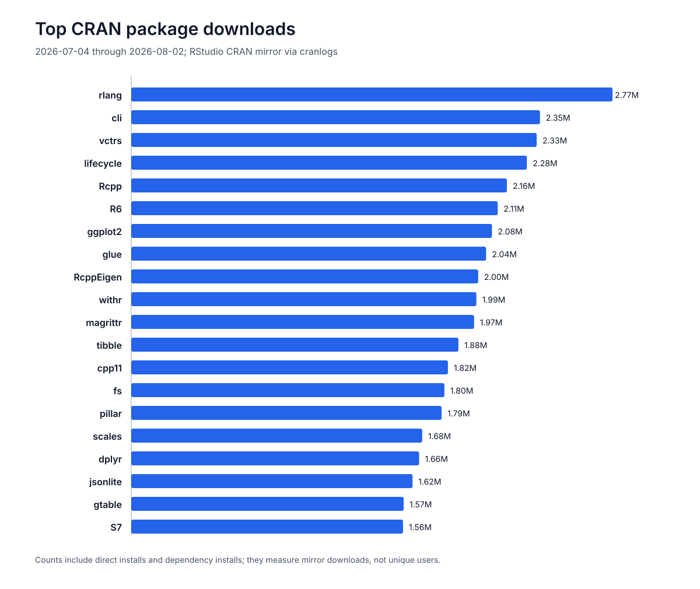
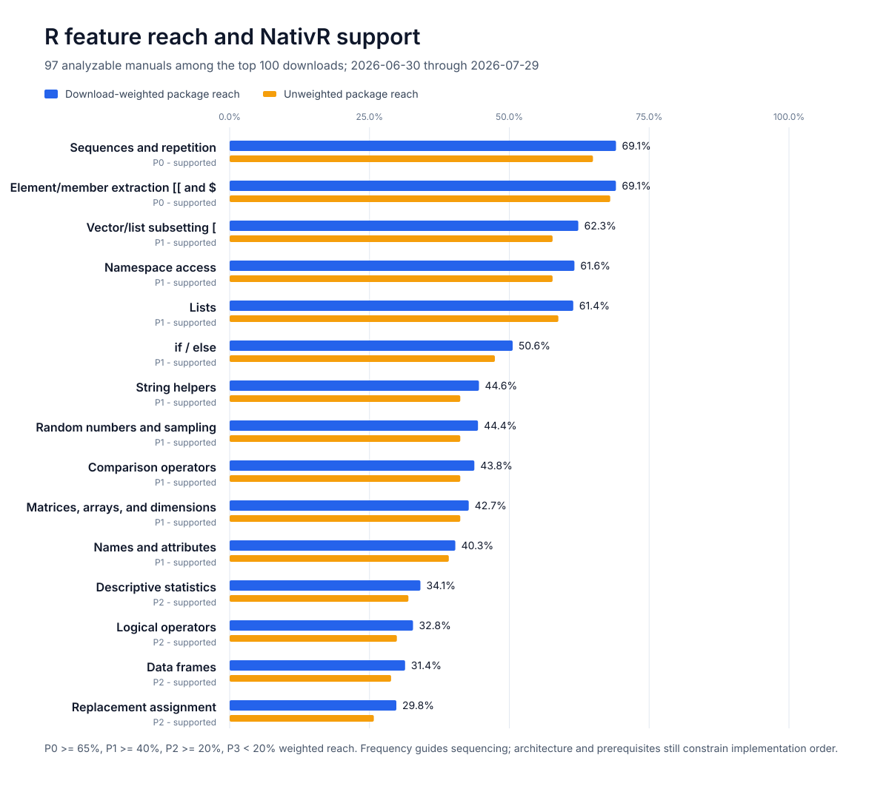
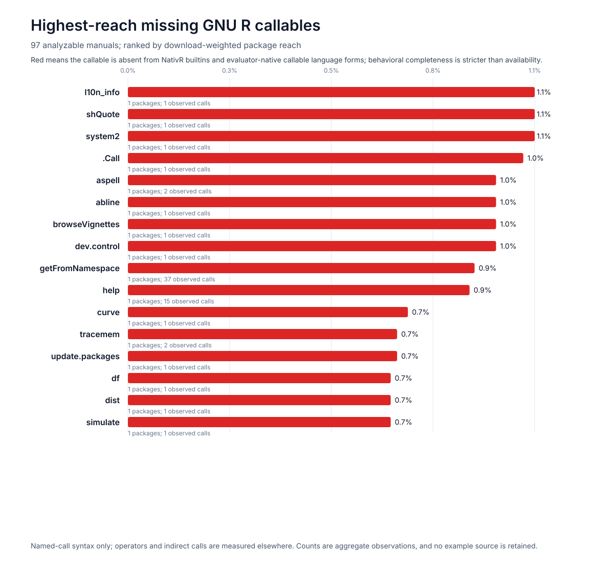

# Evidence-based feature priorities

NativR uses public package-usage evidence to sequence core-language work. The current snapshot
covers the 100 most-downloaded packages reported by [cranlogs](https://cranlogs.r-pkg.org/) for the
30 available days from 2026-06-30 through 2026-07-29.

This evidence guides NativR's browser-native subset. It does not promise compatibility with the
sampled packages. Standard pure-R source packages can enter the bounded build-time installer, while
actual execution remains limited by the measured runtime capabilities each package uses.

## Package sample

The 100-package sample represents 127,485,250 downloads from the RStudio CRAN mirror. Ninety-seven
CRAN reference manuals contained analyzable `Examples` sections, covering 123,672,820 downloads, or
97.0% of the sampled total. Counts include direct installs, dependency installs, automation, and
repeat installs; they are not unique-user counts.

## Feature reach and implementation status

The primary measure is download-weighted package reach: the share of analyzable downloads belonging
to packages whose manual examples contain a feature. Package reach is the unweighted share of the 97
analyzable packages. A package contributes at most once per feature.

| Rank | Measured feature                    | Status    | Weighted reach | Package reach |
| ---: | ----------------------------------- | --------- | -------------: | ------------: |
|    1 | element/member extraction `[[`, `$` | supported |          69.1% |         68.0% |
|    2 | sequences and repetition            | supported |          69.0% |         64.9% |
|    3 | vector/list subsetting `[`          | supported |          62.3% |         57.7% |
|    4 | lists                               | supported |          61.4% |         58.8% |
|    5 | namespace access                    | supported |          61.0% |         56.7% |
|    6 | `if` / `else`                       | supported |          50.6% |         47.4% |
|    7 | random numbers and sampling         | supported |          44.4% |         41.2% |
|    8 | string helpers                      | supported |          44.0% |         40.2% |
|    9 | comparison operators                | supported |          43.1% |         40.2% |
|   10 | matrices, arrays, and dimensions    | supported |          42.8% |         41.2% |
|   11 | names and attributes                | supported |          39.8% |         38.1% |
|   12 | descriptive statistics              | supported |          33.6% |         30.9% |
|   13 | logical operators                   | supported |          32.2% |         28.9% |
|   14 | data frames                         | supported |          30.8% |         27.8% |
|   15 | replacement assignment              | supported |          29.2% |         24.7% |
|   16 | dates and times                     | supported |          26.8% |         23.7% |
|   17 | apply/map family                    | supported |          26.1% |         24.7% |
|   18 | ellipsis arguments                  | supported |          24.8% |         21.6% |
|   19 | factors                             | supported |          23.6% |         20.6% |
|   20 | `for` / `while` / `repeat`          | supported |          21.9% |         19.6% |
|   21 | formulas                            | supported |          20.6% |         19.6% |
|   22 | sorting and matching                | supported |          13.4% |         12.4% |
|   23 | native and magrittr pipes           | supported |          13.4% |         11.3% |
|   24 | `return`                            | supported |          12.7% |         10.3% |
|   25 | S3/S4/R6/S7 object systems          | supported |          10.6% |          8.2% |

For this report, **supported** has a precise acceptance boundary: every operator or function name
recognized by the detector for that row has an executable case in
[`feature-priority.test.ts`](../packages/nativr/test/feature-priority.test.ts). The test contains 25
group cases plus an exact catalog check. Support is still bounded by the
[compatibility contract](compatibility-contract.md); it does not mean complete R/package semantics.

The committed CSV and SVG are generated from the same snapshot, so the status labels in the table,
dataset, and figure cannot be updated independently.

## Callable-level priorities

The coarse feature groups are all runnable, so the collector also counts named-call syntax and
filters names through the checked-in GNU R 4.6.0 black-box callable inventory. Exact names exported
by each sampled package's official CRAN `NAMESPACE` and non-core namespace-qualified calls are
excluded; this prevents package-owned functions from being mislabeled as GNU R core requirements.
The primary ranking remains download-weighted package reach; raw occurrence counts are a secondary
signal.

| Priority | Measured rank | Callable           | Weighted reach | Packages | Observed calls |
| -------: | ------------: | ------------------ | -------------: | -------: | -------------: |
|        1 |           186 | `hist`             |           3.0% |        4 |             19 |
|        2 |           188 | `showClass`        |           2.9% |        2 |              4 |
|        3 |           189 | `packageVersion`   |           2.9% |        2 |              3 |
|        4 |           194 | `Sys.getpid`       |           2.8% |        3 |              6 |
|        5 |           195 | `.libPaths`        |           2.8% |        2 |              6 |
|        6 |           196 | `example`          |           2.8% |        3 |              4 |
|        7 |           203 | `gzcon`            |           2.5% |        2 |              6 |
|        8 |           204 | `vignette`         |           2.4% |        2 |              5 |
|        9 |           205 | `args`             |           2.4% |        2 |              3 |
|       10 |           208 | `registerS3method` |           2.4% |        2 |              2 |

“Not available” means absent from both the generated builtin registry and evaluator-native callable
language forms. It is still only a prioritization signal: an available name is not proof of complete
behavior. The previous leaders `library`, `require`, `requireNamespace`, `tempfile`, `unlink`,
`plot`, `Sys.sleep`, `writeLines`, `readLines`, `file`, `close`, `tempdir`, `file.exists`, `R.home`,
`dir.create`, and `list.files` now have executable browser-memory/package-bundle/graphics paths. The
remaining leaders divide across graphics (`hist`), browser capability adapters, environment/process
surfaces, and distributions. Dynamic caller lookup through `parent.frame` and matrix transpose
through `t` are now complete. Closure `formals` inspection (rank 135, 4.8% weighted reach) and lazy
`replicate` evaluation (rank 148, 4.5% weighted reach) are now complete as well. Rank 144 `Encoding`
is also complete for all 12 observed calls across rlang, utf8, and xfun (4.5% weighted reach),
together with adjacent `Encoding<-`, `enc2utf8`, and `enc2native`. The shared character
representation preserves exact bytes and canonical R marks through subset/replacement,
concatenation, raw conversion, and XDR serialization; this is reusable package infrastructure, not
an assertion that those packages' native components are supported. Rank 149 `rcauchy` is now
complete for four calls across ggplot2, pillar, and purrr (4.2% weighted reach), together with
`dcauchy`, `pcauchy`, and `qcauchy`. The shared distribution path covers seeded random-stream
consumption, vectorized parameters, stable probability tails, formals, and missing/domain behavior
without package-specific rewrites. Rank 162 `Sys.getenv` is now available for all 16 measured calls
across withr, xfun, and pkgbuild (3.7% weighted reach), together with rank 175 `Sys.setenv` across
xfun, memoise, openssl, and zoo (3.3%) and adjacent `Sys.unsetenv`. The shared session-state path is
Worker-safe, resettable, and sufficient for unchanged `withr::with_envvar()` mutation/restoration;
it does not expose the host environment. Rank 163 `image` is now available for the six measured
calls across scales, viridisLite, and RColorBrewer (3.7% weighted reach). Its reusable S3/default
path covers numeric/logical matrices, center or boundary coordinates, regular raster and irregular
polygon grids, colour intervals, missing transparency, and one-row palette strips through the same
Worker graphics journal; it is not a claim of complete base-graphics rendering. Rank 166 `browseURL`
is now available for eight calls across xfun, htmltools, knitr, and httpuv (3.6% weighted reach). R
callbacks and suppression remain evaluator-local; external locations become inert host requests and
existing browser-memory report/image files cross the Worker as bounded byte snapshots. This supplies
a reusable package viewer seam without granting network, DOM, process, or host-file access. Rank 168
`gc` is now available for 17 calls across rlang, matrixStats, and bit64 (3.5% weighted reach). The
no-argument cleanup/benchmark path, GNU R-shaped report matrix, resettable high-water values,
verbose output, adjacent `gcinfo`, and `system.time(gcFirst)` share a deterministic traversal of the
reachable NativR graph; this is not a claim to inspect or force the browser JavaScript heap. Rank
174 `lines` is now available for all 20 measured calls across scales, matrixStats, posterior, and
zoo (3.4% weighted reach). The exported S3 generic and `lines.default` preserve package-method
values and visibility, while ordinary coordinate vectors, matrices, lists, data frames, and complex
values share the existing plot-coordinate adapter. Connected, point, combined, overplotted,
histogram, step, and no-draw types emit existing bounded segment/point commands; incomplete
coordinates split paths and line-versus-point style rules follow the documented first-value and
recycling contract. This is reusable browser graphics infrastructure, not a claim of complete
devices, axes, clipping, or every graphical parameter. Rank 176 `system` is now available through an
explicit host policy for five measured withr/knitr/data.table calls (3.3% weighted reach). Its GNU
R-shaped formals, validation, status/output behavior, and inline/Worker bridge are reusable, but the
measured `R CMD SHLIB`, `pandoc`, and `diff` programs exist only when the embedding application
allows and implements them. The default browser runtime still has no process capability.
`as.difftime` is now available for both measured vctrs/scales calls at rank 177 (3.3% weighted
reach). Plain numeric intervals retain their explicit units, while recycled character formats feed
the shared seconds/minutes/hours/days/weeks constructor with automatic-unit selection, names,
missing values, exact formals, and GNU R-shaped interval attributes. The adjacent `difftime` path
now adds partial unit names, automatic units, and recycling warnings. Locale-specific `%X`,
date-bearing named-zone parsing, POSIXlt conversion, and the full difftime S3 arithmetic/method
family remain explicit compatibility depth. Rank 184 `ls` is now available for all five measured
calls across callr, rstan, and bit64 (3.0% weighted reach), together with its identical `objects`
alias. Caller, explicit, numeric-position, and exact named search-list environments share
non-forcing binding enumeration, hidden-name and pattern filtering, deterministic ordering, and GNU
R-shaped formals. A checked-in source-only package uses the same implementation inside its
namespace. Active bindings, locale collation, exact hash-bucket order, and browser/GNU regexp
differences remain explicit compatibility depth. Rank 186 `hist` is now the highest-ranked missing
callable. Rank 22 `plot` is now available for all 179 measured occurrences across 20 sampled package
manuals, representing 19.1% download-weighted reach. The implementation prioritizes the common
numeric vector/x-y calls and the S3 seam required by package-owned plot methods: point, line, both,
overplotted, histogram, step, and no-draw geometry reuse the owned Worker/Canvas graphics journal.
This is shape-level availability, not complete base-graphics compatibility; specialized methods,
full axes/tick labels, log/aspect layout, margins, clipping, and arbitrary graphical controls remain
declared boundaries. Rank 27 `system.file` is now available at 17.1% weighted reach through bounded,
immutable package-resource paths. Rank 34 `Sys.sleep` adds cooperative Worker-safe waits, while rank
52 `writeLines` and rank 61 `readLines` add session-memory roundtrips and immutable package-text
reads. Ranks 65 `file`, 69 `close`, 71 `tempdir`, and 125 `file.exists` now share a bounded
session-owned connection and path layer; rank 341 `open` and its adjacent `flush`, `isOpen`, and
`seek` operations use the same handles. Ranks 48 `R.home`, 129 `dir.create`, and 135 `list.files`
now share a bounded virtual-directory layer with `dir.exists`, `list.dirs`, `getwd`/`setwd`,
`normalizePath`, `basename`, and `dirname`. Usage-ranked `data`, `write.csv`, and `read.csv` now use
that layer for package data scripts, text datasets, quoted tabular input/output, and deterministic
type conversion. Rank 80 `dev.off` now participates in a multi-device lifecycle. Rank 121 `png`
covers all seven measured calls across five packages through a browser-owned file device,
deterministic command rasterizer, and real PNG encoding. Rank 127 `system.time` now covers all 95
measured calls across six packages through lazy single evaluation, GNU R-shaped `proc_time` results,
and the adjacent `proc.time` session clock. Grouped `split` (rank 155) and real-vector `floor`
(rank 156) are now complete at 4.1% weighted reach each. Factor generator `gl` (rank 158, 4.1%) and
a bounded data-frame `merge` subset (rank 161, 4.0%) are now complete. Data-mask mutation through
`within` (rank 167, 3.8%) and vectorized real/complex trigonometry led by `sin` (rank 177, 3.6%) are
now complete as well. After filtering out already-supported names and architecture-dependent host,
graphics, serialization, and source-loading entries, numeric-order factor coercion through
`as.factor` (rank 187, 3.1%) and grouped transformation through `ave` (rank 188, 3.0%) are now
complete. UTC date construction through `ISOdate` (rank 189, 3.0%) and Cartesian data-frame
construction through `expand.grid` (rank 190, 3.0%) are now complete too. After filtering out
package metadata, graphics, host-memory, process, and object-introspection work, vector insertion
through `append` (rank 195, 2.9%) and vectorized real/complex cosine through `cos` (rank 199, 2.9%)
are now complete. The set-operation family is now complete through `intersect` (rank 186), `setdiff`
(rank 208), and `union` (rank 209), followed by parallel minimum selection through `pmin` (rank 215,
2.4%), lagged vector differencing through `diff` (rank 222, 2.3%), and explicit vector-mode coercion
through `as.vector` (rank 224, 2.3%). Integer-code-point decoding through `intToUtf8` (rank 226,
2.3%) is now complete as well. The bounded `show` generic is now complete for registered
single-object display methods and deterministic fallback output, while rank 227 `rep_len` is already
supported. Matrix-diagonal construction and extraction through `diag` (rank 228, 2.2%) is now
complete too. Rank 229 `identity` is already supported, while rank 230 `textConnection` belongs to
the connection/host-adapter surface. Formula coercion through `as.formula` (rank 231, 2.2%) is now
complete. Quoted evaluation through `evalq` (rank 232, 2.2%) is now complete too. The global
calling-handler surface through `globalCallingHandlers` (rank 233, 2.2%) is now complete as well.
Session search-path inspection through `search` and dynamic R-syntax call inspection through
`sys.call` (ranks 234–235, 2.2% each) are now complete. Rank 236 `force` is already supported, rank
237 `readline` requires an interactive host-adapter contract, ranks 238–239 `difftime` and
`is.character` are already supported, and rank 241 `unserialize` now shares the bounded GNU R XDR
codec with rank 142 `serialize`. Time-series coordinate shifting through `lag` (rank 242, 2.0%) is
now complete. Numeric interval factorization through `cut` (rank 243, 2.0%) is now complete too.
Ranks 244–245 `Sys.setlocale` and `Sys.getlocale` are now complete for evaluator-owned C locale
state and the two monetary profiles required by the later measured `withr` examples; arbitrary host
locales, collation, and time-language mutation remain explicit boundaries. Rank 246 `plot.new` is
now the page-state dependency for the measured raster slice, and rank 247 `logical` is already
supported. Atomic run-length encoding through `rle` (rank 248, 1.9%) is now complete. Rank 249
`deparse` is already supported. Regex match extraction through `regmatches` (rank 250, 1.9%) is now
complete together with its `gregexpr` match-object producer (rank 252, 1.9%) and the supporting
first-match `regexpr` surface. Independent whitespace trimming through `trimws` (rank 251, 1.9%) is
now complete too. Ranks 253–255 require package-metadata, connection, or process-timing host
contracts, while rank 256 `vapply` is already supported. Time-series endpoint inspection through
`end` (rank 257, 1.8%) is now complete. Ranks 258–259 belong to graphics/color architecture; ranks
260 `complex` and 261 `vector` are already supported, while rank 262 `file.remove` requires a
filesystem host contract. Grouped factor reordering through `reorder` (rank 263, 1.7%) and planar
convex-hull selection through `chull` (rank 264, 1.7%) are now complete. Rank 265 `terrain.colors`
belongs to color-generation architecture. Model covariance plus central Student-t probabilities now
complete `confint` (rank 266, 1.7%). Session-local numeric perturbation through `jitter` (rank 267,
1.7%) and argument-choice normalization through `match.arg` (rank 268, 1.7%) are complete. Stable
logistic quantiles through `qlogis` (rank 269, 1.7%) and matrix centering/scaling through `scale`
(rank 270, 1.7%) are complete too. The model architecture completes `aov` and `fitted` (ranks
271–272), and `IQR` (rank 273) covers interquartile ranges through all nine GNU R quantile
algorithms. Numeric clustering through `kmeans` (rank 274, 1.7%) is now complete for the documented
bounded algorithms and data shapes. Ranks 275–278 (`log2`, `predict`, `resid`, and `rt`) are already
supported. Circular, open, and filtering convolution through `convolve` (rank 225, 2.3%) is now
complete, and rank 279 `Filter` is already supported. Hexadecimal integer modes through `as.hexmode`
(rank 280, 1.7%) are now complete together with their formatting, printing, selection, and bitwise
method chain. Ranks 281 `axis`, 282 `readChar`, 283 `debug`, and 285 `undebug` depend on graphics,
connection, or interactive-debug host architecture; rank 284 `emptyenv` is already supported. Rank
286 `as.list.environment` is the next isolated browser-safe callable and is now complete with S3
dispatch, local binding enumeration, hidden-name and sorting controls, hash-aware unsorted order,
and lazy-promise forcing. Rank 287 `list2env` is already supported. Rank 288 `capabilities` is now
complete: the four sampled calls query `cairo` or `profmem`, and the browser runtime truthfully
reports both unavailable while preserving GNU R's full named selection shape. Ranks 289 `pdf` and
290 `title` require graphics-host architecture, rank 291 `exists` is already supported, and rank 292
`kappa` is now complete with QR estimates, exact 2-norm results, direct one-/infinity-norm paths,
triangular controls, and `qr`/`lm` dispatch. Rank 293 `model.matrix` is already supported. Rank 294
`xtabs` is now complete for the sampled RcppEigen factor-table call plus weighted/matrix responses,
subsets, missing-value controls, unused levels, and table metadata. Rank 295 `RNGkind` is now
complete for the six sampled query calls in the
[`withr` reference manual](https://cran.r-project.org/web/packages/withr/refman/withr.html) plus
partial/default kind selection, prior-state return and visibility, warnings, the default
Mersenne-Twister/Inversion pair, and both discrete samplers. Rank 296 `sample.int` is now complete
for the two sampled calls in the same `withr` manual, where it generates a seed from
`.Machine$integer.max`. The implementation also has differential evidence for replacement,
no-replacement, optional hash selection, weighted draws, and populations above the 32-bit integer
range. Rank 297 `Sys.localeconv` is now complete for both sampled `withr` calls: its 18-name
character-vector contract follows session-local monetary state, including the observed `it_IT` and
`en_US` profiles. Rank 298 `attributes` is already supported; ranks 299–302 require filesystem,
process/PATH, or graphics host adapters. Rank 303 `tan` is now complete for the measured
[`testthat`](https://cran.r-project.org/web/packages/testthat/refman/testthat.html) call
`expect_equal(tan(pi / 4), 1)` and the
[`data.table`](https://cran.r-project.org/web/packages/data.table/refman/data.table.html) expression
`tan(pi * (1 / 4 + 1:10))`. The same slice installs the base `pi` binding and adds differential
coverage for logical, integer, double, and complex vectors, attributes, `NA`/`NaN`, infinities, and
domain warnings. Rank 304 `make.names` is now complete for the measured
[`tibble`](https://cran.r-project.org/web/packages/tibble/refman/tibble.html) expression
`.name_repair = ~ make.names(., unique = TRUE)`. The implementation repairs duplicate tibble
arguments through that formula callback and has differential evidence for C-locale syntax, reserved
words, empty and missing names, underscore compatibility, scalar-list coercion, attribute removal,
and GNU R's legal-name-first uniqueness ordering. Rank 305 `start` is now complete for eight
measured calls across two packages with 1,856,101 snapshot downloads. The
[`crayon` manual](https://cran.r-project.org/web/packages/crayon/refman/crayon.html) uses
`start(red)` through its package-owned S3 method, while the
[`zoo` manual](https://cran.r-project.org/web/packages/zoo/refman/zoo.html) calls `start(x)` on
date-indexed series. NativR supplies the generic's default row origin, regular-series period/cycle
coordinates, decimal off-grid fallback, `ts.eps`, negative periods, and S3 dispatch; those external
packages still own their class methods. Rank 306 `NextMethod` is already supported, so rank 307
`as.roman` is now complete for the one measured call in
[`pillar`](https://cran.r-project.org/web/packages/pillar/refman/pillar.html), whose 1,778,760
snapshot downloads give it 1.5% download reach. The exact expression
`utils::as.roman(seq_len(nrow(x)))` now resolves through the bounded `utils` namespace and feeds
pillar's subsequent `as.character`/`nchar` width calculation. Differential evidence also covers the
documented 1-through-4999 range, canonical and repeated-`I` historical forms, missing/invalid
inputs, formatting, idempotence, and matrix metadata. Rank 308 `as.POSIXlt` is now complete for
three measured calls across
[`testthat`](https://cran.r-project.org/web/packages/testthat/refman/testthat.html) and
[`zoo`](https://cran.r-project.org/web/packages/zoo/refman/zoo.html), representing 1,767,637
snapshot downloads and 1.4% download reach. The testthat example constructs `as.POSIXlt(Sys.time())`
and checks `length(x)`; the two zoo examples select observations with
`as.POSIXlt(time(z.na))$mday == 5`. NativR now provides those paths through an owned 11-component
POSIXlt list, UTC/GMT Date/POSIXct/epoch/strict-character decomposition, fractional and missing
seconds, documented class/attributes, and S3 dispatch. Regional time-zone and daylight-saving
databases remain explicit boundaries. Rank 309 `drop` is now complete for five measured calls across
[`matrixStats`](https://cran.r-project.org/web/packages/matrixStats/refman/matrixStats.html) and
[`posterior`](https://cran.r-project.org/web/packages/posterior/refman/posterior.html), representing
1,740,589 snapshot downloads and 1.4% download reach. MatrixStats uses four `identical(drop(Z), Z0)`
validations covering both multi-set matrices and one-set vector results; posterior explicitly
compares `drop(Sigma[1, ])` with `Sigma[1, drop = TRUE]` on an rvar covariance array. NativR removes
singleton extents, rebuilds surviving named dimensions or vector names, keeps zero-length
non-singleton axes, and preserves custom classes, factor levels, and unrelated attributes. Rank 310
`rasterImage` is now complete for two measured calls across
[`systemfonts`](https://cran.r-project.org/web/packages/systemfonts/refman/systemfonts.html) and
[`httr`](https://cran.r-project.org/web/packages/httr/refman/httr.html), representing 1,721,945
snapshot downloads and 1.4% download reach. Systemfonts passes a glyph `nativeRaster` after
`plot.new()` and `plot.window()`; httr passes an RGB(A) array decoded from PNG content. NativR owns
the page/window state, native packed-color and RGB(A)/grayscale conversion, recycled placements,
rotation/interpolation command fields, Worker transfer, and Playground Canvas rendering. This also
completes dependency ranks 246 `plot.new` and 393 `plot.window`. Complete axes, graphical
parameters, color databases, specialized plot methods, and the wider device stack remain explicit
boundaries. Rank 311 `weights` is now complete for 22 measured calls across
[`loo`](https://cran.r-project.org/web/packages/loo/refman/loo.html) and
[`posterior`](https://cran.r-project.org/web/packages/posterior/refman/posterior.html), representing
1,713,212 snapshot downloads and 1.4% download reach. The 12 loo calls and 10 posterior calls target
package-owned S3 methods with `log` and `normalize` combinations. NativR implements the independent
GNU R `stats::weights` generic boundary, default list/pairlist component lookup with unique partial
matching, `na.exclude` restoration, and weighted/unweighted `lm` access. Custom methods receive
their still-lazy arguments through ordinary S3 dispatch; the GPL package method algorithms remain
outside NativR. Rank 312 `rbinom` is already registered. Rank 313 `colours` is now complete for the
exact `alpha(colours(), 0.5)` example in
[`scales`](https://cran.r-project.org/web/packages/scales/refman/scales.html), representing
1,705,683 snapshot downloads and 1.4% download reach. NativR independently records the ordered GNU R
4.6.0 catalog of 657 public color names, returns the documented 502-name unique-RGB subset for
`distinct = TRUE`, preserves `colors`/`colours` function identity, and registers both names under
`grDevices::`. The later rank-366 increment adds bounded `col2rgb`; palette mutation, wider
color-space conversion, and the general graphics-device stack remain separate work. Rank 314 `outer`
is now complete for scales' exact `sqrt(outer(x^2, x^2, "+"))` radial-matrix example from the same
[`scales`](https://cran.r-project.org/web/packages/scales/refman/scales.html) manual, representing
1,705,683 snapshot downloads and 1.4% download reach. The owned implementation covers vector and
array Cartesian products, concatenated dimensions and dimension names, character and callable `FUN`,
still-lazy forwarded dots, the default multiplication path, and `%o%`. It does not claim data-frame
methods, arbitrary package-defined array classes, long-vector allocation, or exact legacy
diagnostics. Rank 315 `is.data.frame` is already registered. Rank 316 `nzchar` is now complete for
the two measured calls across
[`data.table`](https://cran.r-project.org/web/packages/data.table/refman/data.table.html) and
[`shiny`](https://cran.r-project.org/web/packages/shiny/refman/shiny.html), representing 1,689,653
snapshot downloads and 1.4% download reach. The data.table call converts captured regex groups with
`ifelse(nzchar(y), as.numeric(y), Inf)`; the Shiny call guards a selected data-set name. The
implementation covers atomic, bounded list/pairlist, language, and expression coercion, GNU R's
default/missing `keepNA` distinction, zero-length values, attribute removal, and primitive
argument-count/name errors. Factors, environments, and closures retain GNU R-shaped rejection. Exact
encoding marks, invalid multibyte strings, arbitrary recursive deparsing, and every primitive
diagnostic are not claimed. Rank 317 `density` is now complete for 94 measured calls across
[`posterior`](https://cran.r-project.org/web/packages/posterior/refman/posterior.html) and
[`distributional`](https://cran.r-project.org/web/packages/distributional/refman/distributional.html),
representing 1,680,147 snapshot downloads and 1.4% download reach. Posterior contributes two
`density.rvar` grid calls. Distributional contributes 92 `density.distribution` calls; 69 repeat the
scalar `density(dist, 2)` shape with and without `log = TRUE`, while the remainder use character,
matrix, list, and vector evaluation points. NativR implements the independent `stats::density` S3
generic and lazy argument forwarding these package methods require; it does not copy either
package's method algorithms. A bounded `density.default` additionally covers Gaussian direct-kernel
grids, numeric bandwidths and `nrd0`, adjustment, weights, missing-value removal, explicit ranges,
and the documented result shape. Other kernels, FFT-coordinate identity, alternate automatic
bandwidth selectors, infinite point masses, `width`/`ext`/legacy coordinates, arbitrary package
methods, and exact source-derived `data.name` remain explicit boundaries. Rank 318 `sd` is already
registered. Rank 319 `setequal` is now complete for the two calls in
[`dplyr`](https://cran.r-project.org/web/packages/dplyr/refman/dplyr.html), representing 1,675,114
snapshot downloads and 1.4% download reach. Both calls compare data-frame rows: one unequal pair and
one reversed-row equality check. NativR covers those owned data-frame/tibble shapes with
order-insensitive, duplicate-insensitive row matching and compatible column reordering; it also
covers GNU R's base atomic, factor, list, NULL, common-type, duplicate, NA, and NaN set-equality
rules. Tibble rectangular selection now retains tibble class and does not drop a single selected
column, allowing the measured `df1[3:1, ]` expression to remain a table. Arbitrary dplyr methods,
grouped or remote tables, namespace/package loading, pairlists, locale-specific encodings, and
exhaustive recursive-object identity remain outside this increment. Rank 320 `grep` is already
registered. Rank 321 `download.file` is deliberately not the next implementation target because a
general network/file downloader conflicts with the current network-free browser runtime boundary;
rank 322 `eigen` is now complete for jsonlite's `lapply(eigen(matrix(-rnorm(9), 3)), round, 3)`
serialization fixture, representing 1,601,911 snapshot downloads and 1.3% download reach. NativR
computes real symmetric matrices of arbitrary owned order with an independent Jacobi rotation path,
including normalized eigenvectors, decreasing eigenvalues, automatic or explicit symmetry,
`only.values`, lower-triangle selection, and classed result shape. Real non-symmetric matrices of
order one through three use independent characteristic roots and complex null-space eigenvectors,
covering jsonlite's exact random 3-by-3 shape and GNU R's small complex-pair examples. Complex input
matrices, non-symmetric order above three, defective and ill-conditioned exhaustive cases, LAPACK
convergence/rounding identity, and eigenvector phase/sign identity remain explicit boundaries. Ranks
323 `pipe` and 324 `unz` require connection/filesystem host architecture and remain deferred; rank
325 `colSums` is now complete for three observed calls across
[`loo`](https://cran.r-project.org/web/packages/loo/refman/loo.html) and
[`zoo`](https://cran.r-project.org/web/packages/zoo/refman/zoo.html), representing 1,601,512
snapshot downloads and 1.3% download reach. Loo calls `colSums(tab_10)` and `colSums(tab_9)` on
integer fold tables; zoo selects usable columns with `colSums(!is.na(za)) > 0`. NativR covers
logical, integer, double, and complex arrays of rank two or greater, numeric data frames,
column-local `NA`/`NaN` removal, generalized `dims`, empty reductions, and output
names/dimensions/dimnames. The bare-bones `.colSums`, the row/mean family, arbitrary external matrix
classes, extended-precision long-vector accumulation, and platform-specific `NA` versus `NaN`
precedence remain outside this increment. Rank 326 `time` is now complete for 25 observed calls
across [`data.table`](https://cran.r-project.org/web/packages/data.table/refman/data.table.html) and
[`zoo`](https://cran.r-project.org/web/packages/zoo/refman/zoo.html), representing 1,583,147
snapshot downloads and 1.3% download reach. Data.table converts `time(uspop)` into integer years;
zoo's 24 calls read package-owned indexes through `time.zoo`. NativR supplies the ordinary S3
generic, default vector/matrix row coordinates, validated regular-series `tsp` coordinates,
fractional offsets, `ts.eps` integer snapping, and `tsp`/`ts` result metadata while forwarding
custom methods without reproducing zoo. Zoo's `time<-` generic and index storage remain
package-owned, and irregular-series construction, malformed external classes, and the wider
`cycle`/`frequency`/`deltat` family remain outside this increment. Rank 327 `na.omit` is now
complete for eight observed calls across
[`data.table`](https://cran.r-project.org/web/packages/data.table/refman/data.table.html) and
[`zoo`](https://cran.r-project.org/web/packages/zoo/refman/zoo.html), representing 1,583,147
snapshot downloads and 1.3% download reach. Data.table's four calls use its package-owned
`na.omit.data.table`, including the `cols` extension; zoo's four calls remove missing observations
before maxima used in plotting. NativR supplies the S3 generic boundary without reproducing either
package method, plus an independent default for atomic vectors, factors, matrices, data frames, and
regular time series. Default removal treats both `NA` and `NaN` as incomplete, records 1-based
positions and row labels in classed `na.action` metadata, retains matrix/data-frame axes, trims only
leading/trailing missing `ts` observations, and rejects internal time-series gaps. Ordinary lists
and arrays of rank other than two follow GNU R's non-removing default. `na.exclude`, `na.fail`,
`na.pass`, namespace-hidden package methods, exotic class-specific subsetting, and exhaustive
malformed-object behavior remain outside this increment. Rank 328 `ceiling` is now complete for
three observed calls across
[`data.table`](https://cran.r-project.org/web/packages/data.table/refman/data.table.html) and
[`zoo`](https://cran.r-project.org/web/packages/zoo/refman/zoo.html), representing 1,583,147
snapshot downloads and 1.3% download reach. Data.table rounds positive exponential samples upward
before integer-like sampling; zoo's nested `ceiling(ceiling(x) / n) * n` helper aligns plot limits
to tick intervals. NativR returns doubles for logical, integer, and double vectors/arrays, retains
names and arbitrary attributes, preserves distinct `NA`/`NaN` and infinities, and offers direct
`ceiling.<class>` plus basic `Math.<class>` dispatch. This follows the
[GNU R rounding contract](https://stat.ethz.ch/R-manual/R-devel/library/base/html/Round.html).
Factors, Date/POSIXt, complex and nonnumeric defaults reject with bounded errors. Dynamic
`.Generic`/`.Group` bindings inside Math-group methods, built-in data-frame Math methods, every
class-specific method, and exhaustive browser floating-point edge identity remain outside this
increment. Rank 329 `read.table` remains a host-I/O boundary, and rank 330 `which.min` is already
registered. Rank 331 `approx` is now complete for the two observed calls across
[`data.table`](https://cran.r-project.org/web/packages/data.table/refman/data.table.html) and
[`zoo`](https://cran.r-project.org/web/packages/zoo/refman/zoo.html), representing 1,583,147
snapshot downloads and 1.3% download reach. Data.table interpolates the decade-spaced `uspop` series
onto a daily integer/Date-like sequence; zoo maps Date coordinates onto fractional year positions.
NativR supplies `stats::approx` with separate numeric coordinates, one-vector, two-column matrix,
and named `x`/`y` list inputs; linear or constant interpolation; one- or two-sided endpoint rules;
explicit boundaries; `f`; generated `n` grids; default missing-pair removal; missing output
propagation; and ordered, mean, min, max, or callable duplicate reducers. Explicit `xout` retains
its owned numeric attributes, including Date class metadata. This follows the
[GNU R interpolation contract](https://stat.ethz.ch/R-manual/R-devel/library/stats/html/approxfun.html).
`approxfun`, the full `xy.coords` coercion surface, list-valued `ties`, every non-finite coordinate
corner, and exhaustive floating-point identity remain outside this increment. Rank 332 `mapply` is
already registered, as is rank 333 `setGeneric`. Rank 334 `standardGeneric` is now complete for the
one observed call in [`S7`](https://cran.r-project.org/web/packages/S7/refman/S7.html), representing
1,562,896 snapshot downloads and 1.3% download reach. The measured example defines an S4 generic
with `methods::setGeneric("S4_generic", function(x) standardGeneric("S4_generic"))` before S7
registers a class method. NativR's bounded session-local S4 layer now recognizes that definition
shape, forwards declared arguments, defaults, and dots, resolves explicit classes then `ANY`, and
reports calls outside the registered generic body or without a method. This follows the
[GNU R S4 generic contract](https://stat.ethz.ch/R-manual/R-devel/library/methods/html/standardGeneric.html).
The full methods package, multiple dispatch, signature inheritance, sealed classes, package
registration, method caching, primitive/group generics, and S7 itself remain outside this increment.
Rank 335 `colorRampPalette` is now complete for the two identical calls in
[`isoband`](https://cran.r-project.org/web/packages/isoband/refman/isoband.html), representing
1,536,503 snapshot downloads and 1.3% download reach. Both calls define a six-anchor Viridis
palette, request `space = "Lab"`, and generate 21 fill colors. NativR returns a first-class palette
function and independently implements linear RGB or CIE Lab interpolation, positive bias, optional
alpha interpolation, partial argument choices, zero/one-length output, and registered `grDevices::`
lookup. The exact 21-color observed output has byte-for-byte GNU R black-box evidence. This follows
the
[GNU R color-interpolation contract](https://stat.ethz.ch/R-manual/R-devel/library/grDevices/html/colorRamp.html).
Spline interpolation, standalone `colorRamp`, palette mutation, and general device color management
remain outside this increment; the later rank-366 work reuses the complete catalog for `col2rgb`.
The refreshed detector excludes bslib's two locally defined `person()` HTML-helper calls rather than
misclassifying them as `utils::person()`. Rank 336 `sink` remains deferred because utf8's measured
output-redirection example still requires stateful `file()`/`close()` connection objects. The
session `tempfile()` and `readLines()` pieces are now available, but implementing only the sink
switch without that remaining connection vertical path would not run the example. Rank 337
`sessionInfo` is now complete for the one call in
[`otel`](https://cran.r-project.org/web/packages/otel/refman/otel.html), representing 1,478,538
snapshot downloads and 1.2% download reach. The measured expression reads
`utils::sessionInfo()$platform` for a log field. NativR returns a classed, named list containing its
deterministic browser platform and running-host identity, R 4.6 compatibility target, current
session locale and RNG kinds, attached core packages, UTC time-zone contract, and explicit empty
native linear-algebra fields. This follows the
[GNU R session-information shape](https://stat.ethz.ch/R-manual/R-devel/library/utils/html/sessionInfo.html)
without pretending to be the user's OS or a GNU R binary. Package-description enumeration and the
`print.sessionInfo`/`toLatex.sessionInfo` methods remain outside this increment. Rank 338
`as.ordered` is now complete for the one call in
[`generics`](https://cran.r-project.org/web/packages/generics/refman/generics.html), representing
1,477,005 snapshot downloads and 1.2% download reach. The exact example converts `letters[1:5]` to
an ordered factor. NativR installs that lowercase base constant and preserves the measured codes,
labels, levels, and `c("ordered", "factor")` class; returns existing ordered factors unchanged;
removes unused levels from ordinary factor input while preserving names; and forwards dots to
package-defined S3 methods. This follows the
[GNU R factor coercion contract](https://stat.ethz.ch/R-manual/R-devel/library/base/html/factor.html).
The broader generics package namespace, recursive list/expression coercion, locale-specific level
sorting, and complete factor method family remain outside this increment. Rank 339 `as.array` is now
complete for the four detected calls in
[`rstan`](https://cran.r-project.org/web/packages/rstan/refman/rstan.html), representing 1,463,993
snapshot downloads and 1.2% download reach. The manual defines and exercises
`as.array.stanfit(x, ...)`; NativR supplies the generic S3 protocol and does not reproduce rstan's
package-owned object or method. Custom methods receive the classed object and lazy dots. The
independent default adds a one-dimensional extent to atomic vectors, lists, factors, and pairlists;
promotes ordinary names to one-axis dimension names; retains unrelated attributes; and returns
existing arrays unchanged. This follows the
[GNU R array-coercion contract](https://stat.ethz.ch/R-manual/R-devel/library/base/html/array.html).
Expression-vector coercion and arbitrary package-specific methods remain outside this increment.
Rank 340 `is.array` was already supported. Rank 341 `nlm` is now complete for the one call in
[`rstan`](https://cran.r-project.org/web/packages/rstan/refman/rstan.html), representing 1,463,993
snapshot downloads and 1.2% download reach. The measured example passes an objective whose scalar
result carries an analytic `gradient` attribute. NativR preserves that callback protocol, forwards
lazy `...` arguments, checks supplied derivatives, falls back to finite differences, and performs
bounded browser-native BFGS minimization with optional Hessian output and GNU R-shaped result names
and convergence codes. This follows the
[GNU R nonlinear minimization contract](https://stat.ethz.ch/R-manual/R-devel/library/stats/html/nlm.html).
Trace printing, more than 64 parameters, iteration limits above 10,000, and bit-for-bit PORT
algorithm identity remain outside this increment. Rank 342 `optim` is now complete for the adjacent
call in the same [`rstan`](https://cran.r-project.org/web/packages/rstan/refman/rstan.html) example,
with the same 1,463,993 snapshot downloads and 1.2% download reach. The measured call supplies
separate scalar objective and gradient functions and selects `method = "BFGS"`. NativR implements
that independent BFGS vertical path with lazy `...` forwarding, parameter names, user or central
finite-difference gradients, `fnscale` maximization, parameter/derivative scaling, bounded
iterations, optional numerical Hessians, named call counts, and GNU R-shaped result fields. This
follows the
[GNU R general-purpose optimization contract](https://stat.ethz.ch/R-manual/R-devel/library/stats/html/optim.html).
Nelder-Mead, CG, L-BFGS-B, SANN, Brent, box bounds, trace output, method-specific controls, more
than 64 parameters, and exact native-algorithm trajectories remain outside this increment. Rank 343
`pairs` is now complete for the one call in rstan's
[custom pairs method](https://cran.r-project.org/web/packages/rstan/refman/rstan.html), again
representing 1,463,993 downloads and 1.2% reach. The measured example invokes
`pairs(fit, pars = ..., log = TRUE, las = 1)` on a `stanfit`; rstan owns the plotting method. NativR
now registers the `graphics::pairs` S3 generic, forwards the original classed object and lazy
arguments to package-defined methods, and does not imitate Stan posterior objects or package
plotting logic. This follows the
[GNU R scatterplot-matrix generic contract](https://stat.ethz.ch/R-manual/R-devel/library/graphics/html/pairs.html).
The default matrix/data-frame scatterplot layout, formula method, panel callbacks, axes, text, and
general graphics parameters remain outside this extension-point increment. Rank 344 `heat.colors` is
now complete for the measured `rstan` reference-manual call, representing 1,466,422 downloads and
1.2% reach. The registered `grDevices` builtin independently generates GNU R's red-to-yellow and
pale-yellow sequence, including deterministic hexadecimal bytes, optional alpha, reversal, numeric
count truncation, name removal, and empty outputs. This follows the
[GNU R palette contract](https://stat.ethz.ch/R-manual/R-devel/library/grDevices/html/palettes.html).
The related `rainbow`, `terrain.colors`, `topo.colors`, `cm.colors`, `hcl.colors`, `palette`, and
device color-management surfaces are separate compatibility work. In ranks 345 through 353, `open`
now uses the virtual connection layer and `readBin` can retrieve raw bytes from owned binary files;
typed binary decoding remains incomplete. The remaining `write`, `available.packages`, `stderr`,
`barplot`, `devAskNewPage`, `getLoadedDLLs`, and `socketConnection` surfaces require broader browser
adapters, repositories, graphics, connections, or native-library state. Rank 354 `factorial` is now
complete for xfun's
[`factorial(10)` example](https://cran.r-project.org/web/packages/xfun/refman/xfun.html),
representing 1,305,720 downloads and 1.1% reach. The independent implementation uses direct products
for finite non-negative integers and a bounded Lanczos gamma approximation elsewhere, while
retaining vector attributes, `NA`/`NaN` distinctions, non-finite behavior, and one domain-warning
event. This follows the
[GNU R special-functions contract](https://stat.ethz.ch/R-manual/R-devel/library/base/html/Special.html).
Exact platform-libm trajectories near gamma poles, complex gamma values, and the wider beta, gamma,
polygamma, choose, and log-factorial family remain separate work. Ranks 355 `file.copy` and 356
`find.package` remain filesystem/package-loader adapter work; rank 357 `is.factor` was already
supported; rank 358 `l10n_info` remains host-locale adapter work. Rank 359 `lsfit` is now complete
for xfun's measured
[`lsfit(1:9, 1:9)` tree example](https://cran.r-project.org/web/packages/xfun/refman/xfun.html),
again representing 1,305,720 downloads and 1.1% reach. NativR reuses its independent, browser-native
pivoted QR path for vector or matrix predictors, optional non-negative weights, intercept and
tolerance controls, complete-case omission, named coefficients/residuals, and a classed `qr` result
with the fields inspected by `str`. This follows the
[GNU R least-squares-fit contract](https://stat.ethz.ch/R-manual/R-devel/library/stats/html/lsfit.html).
Multiple response columns, `yname` result shaping, LINPACK-internal reflector identity, and exact
platform numeric trajectories remain outside this bounded increment. Rank 360 `shQuote` is
host-shell-specific and remains an adapter item. Rank 361 `strwrap` is now complete for xfun's
measured repeated-text example, representing 1,305,720 downloads and 1.1% reach. The browser-native
implementation accepts atomic paragraph vectors, preserves paragraph and sentence spacing rules,
supports `width`, `indent`, `exdent`, `prefix`, `initial`, and simplified/list-shaped results, and
has black-box evidence for missing values, coercion, empty paragraphs, and input errors. Rank 362
`suppressMessages` was already supported; ranks 363 `Sys.unsetenv`, 364 `system2`, and 365 `.Call`
remain host-environment, process, and native-interface work. Rank 366 `col2rgb` is now complete for
stringr's measured named-color replacement helper, representing 1,237,835 downloads and 1.0% reach.
Reviewing that end-to-end example also exposed an earlier missed browser-safe dependency: rank 207
`rgb`, with 3.1% package reach and 2.6% download-weighted reach, is now complete too. Together they
run the measured `col2rgb` matrix lookup followed by `rgb(..., maxColorValue = 255)`, cover the
complete 657-name catalog, short/long hexadecimal alpha, transparent and missing colors, the default
numeric palette, intensity recycling, names, and matrix/data-frame channel inputs. Rank 367 `colors`
was already supported. The detector now excludes package-owned `$method()`/`@method()` calls, so
htmltools' `tagQ$find()` is no longer misranked as `base::find`; rank 368 `simplify2array` is the
next measured callable and is now complete for stringi's two examples, representing 1,237,835
downloads and 1.0% reach. Equal-length vectors simplify to a common-type matrix, unequal lengths
remain a list, scalar inputs simplify with outer names, and equal-dimensional inputs can retain a
higher array shape and dimension names. List-valued cells, zero-length exception controls,
promotion, names, non-list identity, and invalid `higher` boundaries have GNU R black-box evidence.
Ranks 369 `setwd`, 370 `aspell`, 371 `abline`, 372 `browseVignettes`, and 373 `dev.control` remain
host-filesystem, package-tooling, or graphics-device work; rank 374 `lengths` was already supported.
Rank 375 `getFromNamespace` has 37 apparent calls, but all are backports examples that fetch that
package's private implementations before invoking them. It therefore remains tied to the general
package namespace loader; implementing only a core-namespace facade would not run the measured
examples. Ranks 376 `str2expression` and 377 `str2lang` are now complete for the measured source
strings and represent the same 1,112,829 downloads and 0.9% reach. They reuse the browser-native
Tree-sitter parser and return only owned expression/language/symbol/atomic values, with differential
evidence for vectors, comments, blank text, missing strings, single-result checks, and parse/type
errors. The backports examples' preceding private-namespace retrieval remains outside this claim.
Rank 378 `URLdecode` is now complete for backports' direct `URLdecode("ab%20cd")` example, again
representing 1,112,829 downloads and 0.9% reach. Registered `utils::` lookup, vectorized ASCII and
UTF-8 percent bytes, literal plus signs, missing/empty/NULL values, attribute removal, and NUL
termination have executable evidence. Malformed percent escapes and invalid UTF-8 bytes are
explicitly rejected because browser strings cannot represent GNU R's platform-dependent raw-byte
results losslessly. Rank 379 `warningCondition` is now complete for backports' direct
`warningCondition("warning", class = "testWarning")` call, representing the same 1,112,829 downloads
and 0.9% reach. The owned constructor preserves the GNU R message/call/additional-field order,
prepends custom classes to `warning`/`condition`, supports vector messages, and runs the measured
class-selective `suppressWarnings` expression. Missing custom class elements are an explicit
boundary because NativR's class metadata model cannot preserve them. Rank 380 `help` remains browser
documentation-host adapter work; rank 381 `as.environment` is already supported. Ranks 382 `qbinom`
and 383 `qnorm` are now complete for openssl's `qbinom(rand_num(1000), size=10, prob=0.3)` and
`qnorm(rand_num(1000), mean=100, sd=15)` examples. Each represents 925,846 downloads and 0.7%
weighted reach. The shared vectorized path covers recycled distribution parameters, ordinary/log
lower and upper tails, missing/NaN propagation, longest-input metadata, registered `stats::` lookup,
and differential canonical quantiles. Binomial sizes above 10,000,000 and finite normal
log-probabilities below the browser double range are explicit bounded-algorithm limits. Rank 384
`rawToBits` is now complete for openssl's `as.logical(rawToBits(rnd))` example, again representing
925,846 downloads and 0.7% weighted reach. It expands each owned raw byte into eight raw 0/1 values
in GNU R's least-significant-bit-first order, drops source attributes, accepts empty raw vectors,
and strictly rejects other input types. Ranks 385 `rowMeans` and 386 `colMeans` are now complete for
matrixStats' matrix-subset validation calls, representing 901,775 downloads and 0.7% weighted reach.
The shared column-major reducer covers generalized array `dims`, numeric data frames, real and
complex storage, per-group missing-value removal, surviving axis names, automatic versus explicit
data-frame row names, and empty reductions. Rank 387 `weighted.mean` is now complete for
matrixStats' six comparisons against `weightedMean`, representing the same 901,775 downloads and
0.7% weighted reach. The registered `stats` generic dispatches custom S3 methods; its independent
default covers omitted, finite, negative, zero, infinite, missing, and complex weights, paired
`na.rm` filtering, scalar shape, and attribute removal. Infinite or zero total weight follows GNU
R's non-finite arithmetic rather than inventing a normalization fallback. Rank 388 `mad` is now
complete for matrixStats' `mad(1:10)` and `mad(1:2)` reference values, again representing 901,775
downloads and 0.7% weighted reach. The owned robust-scale path covers default/explicit centers,
scale constants, ordinary/low/high even-sample medians, missing-value removal, empty inputs, and
attribute-free scalars. Rank 389 `curve` is deferred with the broader expression-to-graphics helper;
rank 390 `plot.window` is already registered. Rank 391 `rbeta` is now complete for loo's
`rbeta(1, a0, b0)` prior draw and `as.matrix(rbeta(S, a, b))` posterior draw, representing 870,861
downloads and 0.7% weighted reach. The independent session sampler covers recycled central and
finite non-central parameters, stable log-gamma ratios, deterministic reseeding, distribution
moments, zero/infinite limit distributions, documented `n` length behavior, and missing/invalid
arguments. Exact GNU R beta-deviate stream identity is not claimed. Rank 392 `dbinom` is now
complete for the same loo example's `dbinom(data_i$y, size = data_i$K, prob = draws, log = TRUE)`
call, again representing 870,861 downloads and 0.7% weighted reach. The owned log-density path
covers parameter recycling, ordinary/log output, longest-input metadata, large-count stability,
boundary masses, missing/NaN distinctions, and domain/non-integer warnings. Exact Loader
saddle-point rounding over every huge count remains outside the increment. Rank 393 `mat.or.vec` is
now complete for loo's `b <- mat.or.vec(10, 3)` scratch allocation, again representing 870,861
downloads and 0.7% weighted reach. It creates owned double zeros, returns an unclassed vector only
when `nc == 1`, otherwise attaches the truncated nonnegative row/column dimensions, accepts
zero-sized extents, drops input attributes, and rejects missing or invalid branch/extent inputs.
Rank 394 `droplevels` is already registered. Rank 395 `seq.int` is now complete for data.table's
three rolling-window helper calls: `seq.int(n)` and two uses of `seq.int(n - 1L)`, representing
864,145 downloads and 0.7% weighted reach. The primitive path covers scalar numeric endpoints,
length-based single inputs, ascending/descending steps, fractional `length.out` rounding,
`along.with`, integer/double result selection, internal `seq` S3 dispatch, ignored dots, and strict
finite/resource controls. Rank 396 methods `as` is now complete for data.table's two documented
identity checks between its `as.IDate`/`as.ITime` constructors and `methods::as`, representing
864,145 downloads and 0.7% weighted reach. NativR provides a session-local `setAs` source/target
registry, inherited source-class lookup, core constructor fallback, identity behavior, namespace
access, invisible registration, and bounded invalid-definition/unknown-target errors. The data.table
classes and constructors remain package-owned and are not reproduced. Ranks 397 `as.name` and 398
`is.list` are already registered. Ranks 399/400 `readRDS`/`saveRDS` now use the same XDR/gzip codec
over browser-owned binary files, and rank 401 `tracemem` depends on object-identity instrumentation
that the immutable value model does not yet expose. Rank 402 `weekdays` is now complete for
data.table's two IDate grouping-label calls: `factor(weekdays(idate))` and
`weekday = weekdays(tt$date)`, again representing 864,145 downloads and 0.7% weighted reach. The
base S3 generic resolves the package's inherited Date class and covers deterministic C-locale
full/abbreviated names, recycled coercible abbreviation flags, Date fractions, names,
missing/non-finite values, UTC/GMT POSIXct/POSIXlt inputs, direct methods, custom dispatch, and
invalid inputs. Other locale profiles and the broader `months`/`quarters`/`julian` family remain
separate work. Rank 403 `write.table` is deferred until the browser connection/filesystem adapter
exists. Rank 404 `anyDuplicated` is now complete for data.table's measured
`anyDuplicated(DT, by = c("A", "B"))` query, representing 864,145 downloads and 0.7% weighted reach.
NativR supplies the package-method S3 seam plus independent atomic, factor, list, and data-frame
defaults with forward/reverse first positions, names, missing/NaN distinctions, incomparables, empty
inputs, and bounded control errors. The data.table class and method remain package-owned. Ranks 405
`Im`, 406 `new`, and 407 `Re` are already registered. Rank 408 `rep.int` is now complete for
data.table's adaptive-window helper `an <- function(n, len) c(seq.int(n), rep.int(n, len - n))`,
representing 864,145 downloads and 0.7% weighted reach. It covers scalar whole-vector and
element-wise repetition, truncated/coercible counts, atomic/list/factor/expression storage,
documented attribute removal, factor metadata, custom internal-S3 methods, and allocation guards.
Rank 409 `methods::representation` is now complete for data.table's measured legacy S4 declaration
`representation(x = "character", dt = "data.table")`, representing 864,145 downloads and 0.7%
weighted reach. It returns an ordered plain parent/slot declaration list, decodes backtick slot
names, validates scalar character declarations, rejects duplicate parent or slot entries, and feeds
the bounded `setClass`/`new` path without bundling data.table. Rank 410 `trunc` is now complete for
data.table's measured `trunc(seqtimes, "hours")` ITime method call, representing 864,145 downloads
and 0.7% weighted reach. NativR supplies direct and Math-group S3 dispatch plus an independent
toward-zero default with logical/integer coercion, signed zero, non-finite/missing values,
attributes, eager default dots, and bounded invalid types; data.table retains ownership of ITime and
its method. Rank 411 `utils::type.convert` is now complete for the callback in data.table's measured
`tstrsplit(v, " ", type.convert = list(..., function(x) type.convert(x, as.is = TRUE)))` example,
representing 864,145 downloads and 0.7% weighted reach. Its owned S3 default/list/data-frame methods
cover the logical/integer/double/complex inference ladder, missing/decimal controls,
character/factor fallback, arrays, recursive containers, and custom dispatch. Rank 412
`utils::update.packages` is deferred until the browser package/network adapter exists; rank 413
`get` is already registered. Rank 414 `withVisible` is now complete for Shiny's two measured
stack-trace-control calls, representing 843,616 downloads and 0.7% weighted reach. It captures
literal, assignment, invisible, block, nested, closure, ellipsis, and `evalq` visibility with one
evaluation, while preserving GNU R's distinction between an unforced forwarded promise and an
already-forced lookup. Rank 415 `df()` is a scope-resolution false positive: the Shiny example
defines `df <- eventReactive(...)` before calling that local function, so it is not evidence for
`stats::df`. Rank 416 `dist()` is another Shiny-local callback selected from `rnorm`, `rexp`,
`runif`, or `rlnorm`, not evidence for `stats::dist`. Rank 417 `normalizePath` is a genuine Shiny
filesystem call and remains deferred until the browser file adapter exists. Rank 418 `simulate()` is
a local `card_server` callback parameter rather than a core callable. Rank 419 `strftime` is now
complete for Shiny's measured `strftime(Sys.time(), " [%F %T] ")` log path, representing 843,616
downloads and 0.7% weighted reach. The owned implementation covers recycled UTC/GMT values and
formats, deterministic C-locale calendar/clock/week/epoch/timezone tokens, fractional seconds,
names, non-finite values, timezone labels, and custom `as.POSIXlt` dispatch. Rank 420
`grDevices::as.raster` is now complete for ragg's measured captured-color-matrix conversion,
representing 843,009 downloads and 0.7% weighted reach. It produces the GNU R row-first raster shape
from character matrices, grayscale logical/numeric/raw values, and numeric/raw RGB(A) planes, with
vector reshaping, missingness, scaling, S3, identity, predicates, and downstream `rasterImage` RGBA
evidence. The surrounding `plot.raster` method remains separately deferred. Rank 421 `dev.flush` is
now complete for ragg's genuine zero-argument animation-device call shape, representing 843,009
downloads and 0.7% weighted reach. Its paired `dev.hold` implements nested levels on the owned
browser device; held page/window/raster commands remain bounded and private across evaluations until
a flush reaches zero, then release in order. The executable R 4.6 oracle confirms the measured
call's visible integer return. NativR does not thereby claim ragg's WebP device or encoding. Rank
422 `replayPlot` is now complete for ragg's genuine same-session
`recordPlot()`/`replayPlot(recorded)` sequence, representing 843,009 downloads and 0.7% weighted
reach. The owned browser device records a bounded page/window/raster display list, returns the
observed classed-list shape, retains `load`/`attach` metadata, replays immediately or through
`dev.hold`, and returns invisible `NULL`. It intentionally does not consume GNU R's private
recorded-plot format, reload packages, implement `print.recordedplot`, or claim cross-device
equivalence. Rank 423 `ppoints` is now complete for posterior's two genuine
`quantile(x, ppoints(10))` examples, representing 838,867 downloads and 0.7% weighted reach. The
implementation covers documented 3/8-versus-1/2 defaults, scalar and observation-vector counts,
fractional endpoints, numeric/complex offsets, recycling warnings, attributes, missingness, lazy
nonpositive results, namespace access, and bounded allocation. It does not thereby claim posterior's
`rvar` methods or every GNU R long-vector/class arithmetic edge. Rank 424 `chol` is now complete for
posterior's genuine `chol(d$Sigma)` `rvar` method call, representing 838,867 downloads and 0.7%
weighted reach. The generic supplies the measured S3 extension seam, while `chol.default` adds an
independent upper-triangular real-matrix factor, scalar/data-frame conversion, dimnames, optional
positive-semidefinite pivot/rank metadata, warnings, lazy dots, and bounded controls. This does not
implement posterior's package-owned method, exact LAPACK identity, sparse/tensor factors, or complex
matrices. Rank 425 `pnorm` is now complete for posterior's genuine `pnorm(1.5, mean = 1:4, sd = 2)`
comparison, again representing 838,867 downloads and 0.7% weighted reach. The owned implementation
covers vectorized/recycled quantiles, means, and deviations, lower/upper and ordinary/log tails,
longest-input metadata, zero-deviation point masses, missing values, NaN warnings, empty inputs,
namespace access, and far-log-tail probabilities evaluated without intermediate underflow. It does
not claim bit-for-bit identity across every subnormal/libm boundary, complex quantiles, arbitrary
class-specific dispatch, or the wider normal-distribution family. Rank 426 `rgamma` is now complete
for posterior's genuine `rdo(rgamma(1, shape = 1, rate = 1))`, `rfun(rgamma)`, and
`rvar_rng(rgamma, 1, shape = 1, rate = 1)` examples, again representing 838,867 downloads and 0.7%
weighted reach. It exposes the existing owned gamma sampler with documented `n` lengths, recycled
shape/rate/scale parameters, equivalent/conflicting dual-parameter checks, deterministic reseeding,
statistical moments, zero/infinite limits, empty parameters, missing/NaN/domain warnings, and
namespace access. Exact GNU R Ahrens-Dieter draw sequences, every underflow boundary, class-specific
inputs, and the wider gamma density/CDF/quantile family are not claimed. Rank 427 `segments` is the
now complete for posterior's genuine `segments(seq_along(eight_schools$theta), y0 = q5, y1 = q95)`
credible-interval example, again representing 838,867 downloads and 0.7% weighted reach. The
browser-owned implementation covers the omitted-`x1` vertical-line default, coordinate and style
recycling, character/numeric colors, named/numeric/custom line types, line widths,
missing/non-finite omission, zero-length boundaries, Worker graphics transport, pixel-checked Canvas
drawing, hold/flush, and same-session record/replay. Coordinate classes, log axes, complete
clipping/margins, `...` graphical parameters, device-specific dash metrics, and rendering identity
across GNU R devices are not claimed. Rank 428 `glob2rx` is now complete for rprojroot's genuine
`glob2rx("DESCRIPTION")` file-root pattern, representing 838,555 downloads and 0.7% weighted reach.
The browser-owned text converter covers vectorized wildcards and anchors, documented
leading/trailing trimming, limited regex punctuation escaping, Unicode, NULL/missing and coerced
atomic/list/language inputs, attribute removal, namespace access, scalar logical controls, errors,
and bounded output. It does not claim filesystem traversal, platform path semantics, arbitrary byte
encodings, undocumented escape behavior, or general regex execution. Rank 429 `sQuote` is now
complete for httr's two genuine `sQuote(req$url)` callback-log expressions, representing 836,708
downloads and 0.7% weighted reach. The browser-owned formatter covers deterministic C-locale ASCII
quotes, explicit UTF-8 and TeX styles, arbitrary custom single-quote pairs, `useFancyQuotes` option
changes, owned-value coercion, missing/NULL values, removed attributes, and bounded output. It does
not claim host-locale quote discovery, arbitrary byte encodings, custom `as.character` methods,
`dQuote`, or exact formula-source reconstruction. Rank 430 `family` is now complete for the S3
extension point exercised by distributional's genuine `family(dist)` example, representing 836,291
downloads and 0.7% weighted reach. The owned generic covers stats-namespace lookup, lazy dots,
ordered class dispatch, `NextMethod`, user-defined default methods, visibility, and no-method
boundaries. It does not claim distributional object construction or its package-owned
`family.distribution` method, namespace loading, `family.glm`, or complete GLM-family behavior. Rank
431 `View` is now complete for rstudioapi's genuine `View(rstudioapi::terminalContext(termId))`
example, representing 809,771 downloads and 0.7% weighted reach. The call occurs in a non-running
manual example, so its evidence weight remains limited; the implemented browser slice nevertheless
covers owned data-frame/vector/list/array coercion, custom `as.data.frame` dispatch, non-empty
extent checks, deterministic character cells, titles and non-default row names, invisible return
behavior, structured inline/Worker events, output limits, and Playground rendering. It does not
claim a desktop spreadsheet window, editing, arbitrary package column formatting, or RStudio
terminal APIs. Rank 432 `setMethod` was already supported by the bounded S4 registry. Rank 433
`path.expand` is now complete for diffobj's genuine
`file.path(path.expand("~"), "web", "mycss.css")` example, representing 777,944 downloads and 0.6%
weighted reach. The browser contract follows R's documented unknown-home behavior and leaves leading
tildes unchanged. Its previously unresolved `file.path` dependency is also complete; that
constructor occurs in 20 analyzed packages and 48 calls with 20.2% download-weighted reach. Coverage
includes vectorized construction, recycling, separators, missing/coerced components, zero-length
propagation, strict `path.expand` character input, attribute removal, namespace access, errors, and
resource limits. It does not claim host-home discovery, normalization, existence checks, filesystem
access, platform encodings, or GNU R's Windows-specific trailing-separator cleanup. Rank 434
`setOldClass` is now complete for diffobj's genuine `setOldClass("zulu")` declaration before its
`guidesPrint` S4 method, again representing 777,944 downloads and 0.6% weighted reach. Coverage
includes session-local non-empty class-chain registration, inherited single-object S4 generic
dispatch, inherited explicit coercion lookup, prototype and environment arguments, namespace access,
invisible return behavior, input errors, and explicit unsupported bridge boundaries. It does not
claim namespace-scoped metadata, `test = TRUE` verification, explicit `S4Class` bridges, multiple
dispatch, full class representations, or methods cache behavior. Rank 435 `show` is now complete for
diffobj's genuine `show(StyleAnsi256LightYb())` example, again representing 777,944 downloads and
0.6% weighted reach. The package constructor and method remain package-owned; independently
registered equivalents demonstrate exact and inherited old-class method lookup, bounded text output,
visible/invisible method results, namespace access, deterministic fallback display, argument errors,
and output limits. This does not claim diffobj classes/styles, ANSI/HTML capability handling,
pagers, automatic bare-expression S4 display, multiple dispatch, or the complete methods display
protocol. Rank 436 `capture.output` is now complete for httpuv's genuine
`cat(capture.output(str(as.list(req))), sep = "\n")` WebSocket request-inspection example,
representing 770,373 downloads and 0.6% weighted reach. The browser-owned implementation captures
visible expression printing plus `cat`/`print` output in memory, preserves partial and empty lines,
selects output or message streams, supports nested captures and `split = TRUE`, observes the output
budget, and is available through `utils::`. GNU R differential evidence also covers argument
matching, prefix selection, visibility, and the newline-terminator rule used by the measured `cat`
call. Files, connections, warning/error sinks, arbitrary print-method behavior, and complete sink
stack semantics are not claimed. Rank 437 `demo` is now complete for the documented
`demo("echo", package = "httpuv")` call boundary, representing the same 770,373 downloads and 0.6%
weighted reach. NativR reproduces GNU R's empty `packageIQR` catalog shape without consulting an
installed R library, while topic lookup, external package demo discovery, and script execution fail
explicitly until package loading and virtual package resources exist. It does not claim that the
httpuv demo—or any external package demo—currently runs. Rank 438 `RNGversion` is now complete for
zoo's repeated `suppressWarnings(RNGversion("3.5.0")); set.seed(1)` example setup, representing
731,390 downloads, 17 measured calls, and 0.6% weighted reach. It selects
Mersenne-Twister/Inversion/Rounding for R versions from 1.7 through 3.5, emits the historical
Rounding warning, returns the prior kind vector invisibly, and restores Rejection for R 3.6 or
newer. The Wichmann-Hill/Marsaglia and Buggy Kinderman-Ramage defaults needed before R 1.7 fail
explicitly rather than silently using the wrong generator. Ranks 439 `window`, 440 `as.ts`, 442
`frequency`, and 443 `ts` are now complete as one dependency-ordered regular time-series foundation,
representing zoo's 731,390 downloads, respectively 14, 7, 6, and 5 measured calls, and 0.6% weighted
reach. GNU R differential evidence covers vector/matrix construction, calendar coordinates, endpoint
recycling, coercion, frequency lookup, regular windows, integral downsampling, extension with typed
missing values, warnings, namespace access, and independently registered package methods. Zoo's own
irregular index constructors and methods remain package-owned and are not claimed until an audited
bundle fits the loader and supported runtime surface. Rank 444 `legend` is now complete for zoo's
731,390 downloads, three measured calls, and 0.6% weighted reach. The browser-owned subset covers
the observed bottom-left, bottom-right, and top-left line/point keys plus coordinate placement,
recycled colors/styles, boxes, columns, titles, invisible geometry results, Worker transport, Canvas
pixels, and display-list replay. General graphical `...`, fill/density legends, expression labels,
exact device text metrics, and the complete base-graphics stack remain explicit boundaries. Rank 445
`comment` and its replacement form are now complete for zoo's two measured calls, representing
731,390 downloads and 0.6% weighted reach. The observed example attaches two character metadata
lines to a classed series and reads them back without affecting default printing. Differential
evidence also covers absent comments, missing values, `NULL`/empty removal, attribute preservation,
`attr<-` validation, visibility, namespace access, and invalid replacements. Comments on closures,
environments, and language objects await the future general attribute model. Rank 446 `cycle` is now
complete for zoo's two measured calls, representing 731,390 downloads and 0.6% weighted reach. The
owned default derives observation numbers from validated regular `tsp` metadata for vectors and
matrix rows, including calendar starts and fractional frequencies, while the S3 generic forwards
lazy dots to independently supplied methods such as `cycle.zoo`. Zoo's irregular-series method,
index storage, and package loading remain package-owned. Rank 447 `signif` is now complete for zoo's
two measured calls, again representing 731,390 downloads and 0.6% weighted reach. The observed
maxima are rounded to two significant digits before sizing a primary/secondary plot axis.
Differential evidence covers real and complex vectors, decimal ties-to-even, recycled and clamped
1–22 digit controls, missing and non-finite values, metadata retention, allocation limits, and
direct/Math-group S3 methods. Exact identity for every platform decimal-to-binary boundary remains
outside the claim. Rank 448 `axTicks` is now complete for zoo's measured secondary-axis tick lookup,
representing 731,390 downloads, one measured call, and 0.6% weighted reach. The owned linear path
derives horizontal or vertical ticks from `plot.window()` state, supports explicit `axp`, ascending
and descending axes, coercible sides, lazy `usr`/`nintLog`, namespace access, and allocation limits.
Logarithmic axes, `par("xaxp"/"yaxp")`, complete `pretty` boundary identity, and axis drawing remain
explicit boundaries; a separate session-local `par()` subset now covers common query, update, and
restoration patterns. Rank 449 `box` is now complete for zoo's measured plot-frame redraw,
representing 731,390 downloads, one measured call, and 0.6% weighted reach. The owned plot-region
path resolves all documented `bty` edge shapes, `col`/`fg`, line type, and positive width before a
bounded event crosses the Worker boundary and reaches Canvas or same-session record/replay. Figure,
inner, and outer regions require a future margin/layout model. Rank 450 `boxplot` is now complete
for zoo's measured grouped-series call, representing 731,390 downloads, one measured call, and 0.6%
weighted reach. The owned S3/default path computes Tukey statistics for vector, list, and matrix
groups and carries resolved boxes, whiskers, notches, and outliers through Worker/Canvas and
same-session record/replay. Formula/data-frame methods, logarithmic axes, arbitrary `pars`, complete
annotation/axes, and device-identical layout remain explicit boundaries. Rank 451 `deltat` is now
complete for zoo's measured regular-series sampling-interval call, representing 731,390 downloads,
one measured call, and 0.6% weighted reach. The generic forwards lazy dots to package methods such
as `deltat.zoo`; its owned default returns one or the reciprocal of validated `tsp` frequency. Zoo's
irregular-series inference and package methods remain package-owned. Rank 452 `embed` is now
complete for zoo's measured lagged-window dependency, representing 731,390 downloads, one measured
call, and 0.6% weighted reach. The owned path produces current-to-past column-major windows for
supported vectors and multivariate matrices with source-type preservation, attribute removal,
fractional-vector behavior, GNU R matrix coercions, and pre-allocation result limits. Factor
vectors, data frames, expression vectors, raw/list matrices, and fractional nonempty-matrix
dimensions remain explicit boundaries. Rank 453 `findInterval` is now complete for
[zoo's](https://cran.r-project.org/web/packages/zoo/refman/zoo.html) measured irregular-Date
rolling-window width expression, representing 731,390 downloads, one measured call, and 0.6%
weighted reach. The owned
[documented interval search](https://stat.ethz.ch/R-manual/R-devel/library/base/html/findInterval.html)
uses bounded binary search with missing-query propagation, duplicate/infinite breakpoints,
left/right closure and inside controls, numeric coercion, and sortedness validation. Unsafe
unchecked break vectors, recursive-list coercion, and long-vector indices remain explicit
boundaries. Rank 454 `gray.colors` is now complete for
[zoo's](https://cran.r-project.org/web/packages/zoo/refman/zoo.html) measured
`gray.colors(2, start = 0.7)` call, representing 731,390 downloads, one measured call, and 0.6%
weighted reach. Rank 455 `grey` is complete through the same shared path for zoo's measured
`grey(7:1/8)` call at the same reach. The owned
[gray palette](https://stat.ethz.ch/R-manual/R-devel/library/grDevices/html/gray.colors.html) and
[gray-level](https://stat.ethz.ch/R-manual/R-devel/library/grDevices/html/gray.html) constructors
cover all four documented gray/grey aliases, deterministic RGB(A) bytes, gamma correction, alpha
recycling, reversal, and bounded allocation. Vector-valued palette controls, device profiles, and
the remaining palette families are explicit boundaries. Rank 456 `ISOdatetime` is now complete for
[zoo's](https://cran.r-project.org/web/packages/zoo/refman/zoo.html) measured five-date POSIXct
index constructor, representing 731,390 downloads, one measured call, and 0.6% weighted reach. The
owned [documented wrapper](https://stat.ethz.ch/R-manual/R-devel/library/base/html/ISOdatetime.html)
reuses the existing `ISOdate` calendar path with required clock components, ordinary recycling,
fractional seconds, UTC/GMT controls, calendar validation, and POSIXct metadata. Empty `tz` uses
deterministic UTC arithmetic while retaining its empty label; regional zones/DST, platform-specific
invalid-time normalization, and broad character coercion remain boundaries. Rank 457 `persp` is now
complete for [zoo's](https://cran.r-project.org/web/packages/zoo/refman/zoo.html) measured
`persp(1:nO, 1:nC, zz)` call over a classed `100 × 10` numeric matrix, representing 731,390
downloads, one measured call, and 0.6% weighted reach. The owned
[documented perspective path](https://stat.ethz.ch/R-manual/R-devel/library/graphics/html/persp.html)
preserves S3 forwarding, computes scaled or aspect-preserving homogeneous view matrices, omits
missing grid edges, and emits a bounded default wireframe/box through Worker-safe line commands.
Facet colors, lighting, axis arrows/ticks/text, hidden-line equivalence, hooks, `trans3d`, and
arbitrary graphical controls remain boundaries. Rank 458 `points` is now complete for
[zoo's](https://cran.r-project.org/web/packages/zoo/refman/zoo.html) documented
`points.zoo(x, y = NULL, type = "p", ...)` package extension point, representing 731,390 downloads,
one measured occurrence, and 0.6% weighted reach. The owned
[documented default](https://stat.ethz.ch/R-manual/R-devel/library/graphics/html/points.html)
preserves S3 forwarding and resolves vector/matrix/data-frame/list/complex coordinates plus recycled
plotting symbols, colors, fills, sizes, and widths into a bounded Worker point command. Missing
drawing entries are omitted; display-list replay and Canvas pixels share that command. Line/path
types, locale-dependent glyph codes, coordinate classes, clipping/log axes, font identity, and
arbitrary graphical controls remain boundaries. Rank 459 `polygon` is now complete for
[zoo's](https://cran.r-project.org/web/packages/zoo/refman/zoo.html) measured `pnl.xyarea` helper,
which closes an observed series against a fill baseline, representing 731,390 downloads, one
measured occurrence, and 0.6% weighted reach. The owned
[documented default](https://stat.ethz.ch/R-manual/R-devel/library/graphics/html/polygon.html)
normalizes vector/matrix/data-frame/list/complex coordinates, splits missing-coordinate runs, and
resolves recycled fills, borders, line types/widths, solid/no-fill density, and even-odd fill rules
into a bounded Worker polygon command. Display-list replay and Canvas fill/border pixels share the
same command. Hatch-pattern density, broader coordinate classes, clipping/log axes, exact dash
metrics, and arbitrary graphical controls remain boundaries. Rank 460 `replace` is now complete for
[zoo's](https://cran.r-project.org/web/packages/zoo/refman/zoo.html) measured
`replace(x, 1:min(length(x)), 3)` missing-run helper, representing 731,390 downloads, one measured
occurrence, and 0.6% weighted reach. The owned
[documented helper](https://stat.ethz.ch/R-manual/R-devel/library/base/html/replace.html) reuses
NativR's immutable subset-replacement engine for numeric/logical/character subscripts, recycling,
names/extension, atomic promotion, matrices, factors, lists, pairlists, owned data frames, and
`NULL` materialization/deletion. Expression vectors, arbitrary class-specific `[<-` methods, exact
legacy diagnostics, and long vectors remain boundaries. Rank 461 `rlnorm` is now complete for
[zoo's](https://cran.r-project.org/web/packages/zoo/refman/zoo.html) measured
`rlnorm(200, mean = 1)` flow generator, representing 731,390 downloads, one measured occurrence, and
0.6% weighted reach. The owned
[documented distribution path](https://stat.ethz.ch/R-manual/R-devel/library/stats/html/Lognormal.html)
uses the session Mersenne-Twister/Inversion stream, matches the pinned historical fixed-seed
sequence, follows scalar/vector `n`, recycles `meanlog`/`sdlog`, handles zero-deviation point
masses, missing/domain warnings, and allocation limits. Alternative normal generators, bit identity
beyond the Inversion path, and `dlnorm`/`plnorm`/`qlnorm` remain boundaries. Rank 462 `tapply` is
now complete for [zoo's](https://cran.r-project.org/web/packages/zoo/refman/zoo.html) measured
`tapply(1:ncol(x), screens, f)` screen-range grouping path, representing 731,390 downloads, one
measured occurrence, and 0.6% weighted reach. The owned
[documented ragged-array path](https://stat.ethz.ch/R-manual/R-devel/library/base/html/tapply.html)
preserves factor-level dimensions and names, omits missing groups, forwards callback arguments,
supports scalar/default simplification and list-array results, and exposes `FUN = NULL` group codes.
Formula indexes, custom split methods, broader class-specific simplification, and long vectors
remain boundaries. Rank 463 `graphics::text` is now complete for
[zoo's](https://cran.r-project.org/web/packages/zoo/refman/zoo.html) measured rotated series-label
call, representing 731,390 downloads, one measured occurrence, and 0.6% weighted reach. The owned
[documented text path](https://stat.ethz.ch/R-manual/R-devel/library/graphics/html/text.html)
carries recycled coordinates, labels, colors, sizes, font faces, positions, adjustment, offset,
rotation, and family through bounded Worker/Canvas and display-list paths. Plotmath, Hershey fonts,
class-specific label coercion, clipping/log axes, and device-identical metrics remain boundaries.
Rank 464 `stats::update` is now complete for
[zoo's](https://cran.r-project.org/web/packages/zoo/refman/zoo.html) documented
`update(trellis.last.object(), type = c("l", "g"))` lattice extension call, representing 731,390
downloads, one measured occurrence, and 0.6% weighted reach. The owned
[documented generic path](https://stat.ethz.ch/R-manual/R-devel/library/stats/html/update.html)
preserves lazy dots and supports inherited S3/`NextMethod` dispatch plus independently authored
default methods. Lattice's package-owned method and GNU R's built-in stored-call rewriting and
re-evaluation remain boundaries. Rank 465 `graphics::matplot` is now complete for
[bit64's](https://cran.r-project.org/web/packages/bit64/refman/bit64.html) six measured
matrix-performance plots, representing 722,206 downloads and 0.6% weighted reach. The owned
[documented matrix-plot path](https://stat.ethz.ch/R-manual/R-devel/library/graphics/html/matplot.html)
cycles vector/matrix/data-frame columns and point/line styles, omits incomplete pairs, resolves
linear and logarithmic coordinates, and reuses bounded page/window/box/segment/point Worker/Canvas
and display-list commands. Full axes/annotations, class-specific plotting methods, `add = TRUE`,
step/histogram types, and device-identical layout remain boundaries. Ranks 466–469 are already
registered. Rank 470 `base::aperm` is now complete for
[bit64's](https://cran.r-project.org/web/packages/bit64/refman/bit64.html) measured `aperm(A, 2:1)`
array-method requirement, representing 722,206 downloads, one measured occurrence, and 0.6% weighted
reach. The owned
[documented array-permutation path](https://stat.ethz.ch/R-manual/R-devel/library/base/html/aperm.html)
adds `aperm`/`aperm.default` S3 dispatch, `NextMethod`, numeric/character axis permutations, reverse
defaults, resized or fixed dimensions, dimnames, atomic/list arrays, lazy dots, and bounded
column-major storage reordering. Table methods, malformed low-level attributes, exact diagnostics,
and long vectors remain boundaries. Rank 471 `base::dget` is now complete for
[bit64's](https://cran.r-project.org/web/packages/bit64/refman/bit64.html) measured `dput`/`dget`
roundtrip, representing 722,206 downloads, one measured occurrence, and 0.6% weighted reach. The
owned
[documented text-serialization path](https://stat.ethz.ch/R-manual/R-devel/library/base/html/dput.html)
also closes the higher-reach `tempfile` and `unlink` prerequisites through bounded
`nativr://session-temp/...` browser-memory paths. Atomic vectors, nested lists/pairlists, names,
ordinary attributes, data-frame metadata, bit64's classed double column, missing/NaN/infinite
values, complex/raw storage, and Unicode have roundtrip coverage. Host paths and connections,
nondefault controls, function/environment graphs, cycles, binary serialization, and cross-session
persistence remain boundaries. Ranks 465/466 `base::load` and `save` now cover bit64's observed
workspace save/remove/load flow on the same browser-memory resource seam. The refreshed CRAN
NAMESPACE attribution correctly excludes bit64's package-owned `hashtab` export rather than
mislabeling it as `base::hashtab`; remaining priorities return to the higher-reach gaps above.

## Completed implementation order

Frequency was the primary signal, with dependency order and browser-first architecture breaking
ties:

1. Core collections and selection: sequences, lists, names, operators, extraction, and indexing.
2. Control flow: conditionals, returns, and bounded loops.
3. Vector productivity: strings, deterministic RNG/sampling, dimensions, matrices/arrays, and
   descriptive statistics.
4. Structured data: frames, replacement, factors, ellipsis, and apply/map helpers.
5. Higher-level forms: formulas, native and magrittr-style pipes, registered namespaces, S3
   dispatch, and bounded S4/R6/vctrs constructors.
6. Text output: browser-safe `print`/`cat`, ordered inline/Worker events, return visibility, and
   output-budget accounting.
7. Structural inspection: class-preserving `head` selection and bounded, invisible `str` output.
8. Strict comparison: recursive `identical` across the owned value model and documented controls.
9. Initial conditions: `try`, error/finally handlers, stop/assertion paths, warning/message streams,
   suppression, and visibility.
10. Session state: resettable `options`/`getOption` behavior and print-option integration.
11. Host mode: deterministic non-interactive behavior for inline and Worker evaluations.
12. Numeric rounding: vectorized real/complex decimal `round` with exact ties-to-even behavior.
13. Elementary math: real/complex logarithms and exponentials with domain and metadata behavior.
14. Data-mask evaluation: lazy `with` masks, `local` environments, and propagated visibility.
15. Tolerant comparison: recursive `all.equal` plus exact scalar truth predicates.
16. Vectorized conditional selection: lazy, recycled `ifelse` branches with test metadata.
17. Logical summaries: eager, missing-aware `any` and `all` reductions with coercion boundaries.
18. Data-mask selection: lazy `subset` predicates and column expressions across core data shapes.
19. Environment removal: captured-name `rm`/`remove` mutation with inheritance controls.
20. Reversal: attribute-compatible `rev` across owned vector and list shapes.
21. Cumulative summaries: typed sums/products/extrema with missing and overflow behavior.
22. Function cleanup and class marking: delayed `on.exit` handlers plus attribute-preserving `I`.
23. Function inspection and flattening: owned closure `body` values plus recursive/shallow `unlist`.
24. Data-mask mutation and trailing selection: non-sequential `transform` columns plus
    attribute-aware vector/list/expression/matrix/data-frame `tail`.
25. Dynamic frames and transposition: caller-stack `parent.frame` plus column-major, dimname-aware
    `t` across core matrix shapes.
26. Function signatures and repeated evaluation: closure and explicitly modeled builtin `formals` as
    owned pairlists, `formals<-`/`environment<-` wrapper generation, plus lazy `replicate`
    evaluation with list, matrix, and array simplification. Unchanged `withr 3.0.3` now exercises
    this path end to end through `with_options()`.
27. Grouping and integerization: factor-level-aware `split` across owned data shapes plus
    metadata-preserving real-vector `floor`.
28. Factor patterns and joins: truncating `gl` factor construction plus bounded atomic-column
    data-frame `merge` behavior for explicit/default keys, duplicate matches, missing values, outer
    joins, sorting, suffixes, and Cartesian products.
29. Mask mutation and trigonometry: list/data-frame `within` mutation plus metadata-preserving
    real/complex `sin` with GNU R missingness and warning behavior.
30. Factor coercion and grouped transformations: numeric-order `as.factor` plus multi-group `ave`
    with scalar/vector function results, missing-group retention, callable lookup, and
    type-preserving replacement.
31. UTC construction and Cartesian frames: recycled UTC/GMT `ISOdate` components plus atomic
    `expand.grid` generation with first-column-fast ordering, factor controls, list input,
    zero-length shapes, and output-dimension metadata.
32. Insertion and cosine: type-promoting `append` across vector-like owned shapes plus
    metadata-preserving real/complex `cos` with missingness and domain-warning behavior.
33. Stable set operations: common-type atomic matching, left-type `setdiff`, factor-level unions,
    strict list-element equality, NULL identities, and attribute-free result shapes across
    `intersect`, `setdiff`, and `union`.
34. Parallel minima: recycled common-type `pmin` selection with first-input attributes, exact
    missing-value removal, NA/NaN identity, zero-length short-circuiting, and bounded factor
    behavior.
35. Lagged differences: repeated whole-number `diff` operations across numeric/complex vectors and
    matrices, with names/dimnames, integer overflow, missing-value identity, Date/POSIX `difftime`
    units, and regular time-series index updates.
36. Vector-mode coercion: attribute-dropping atomic `as.vector` defaults, factor label/code modes,
    explicit logical/integer/double/complex/character/raw conversion, scalar-list coercion,
    list/pairlist/expression construction, data-frame unclassing, and owned-language call
    decomposition.
37. Unicode code points: `intToUtf8` conversion for coercible integer-code-point inputs, combined
    and per-element output, missing/invalid values, zero omission, supplementary-plane characters,
    and explicitly enabled UTF-16 surrogate pairs.
38. Matrix diagonals: `diag` construction from scalar dimensions or recycled atomic values,
    rectangular and zero-dimensional shapes, factor/list/character coercion, and type-preserving
    extraction with GNU R-compatible matching dimension names.
39. Formula coercion: `as.formula` conversion from character or owned language values, caller and
    explicit environment attachment (including `NULL`), existing-formula identity, and the
    deprecated multi-string warning path.
40. Quoted evaluation: `evalq` capture without eager forcing, caller/explicit/`NULL` environments,
    list, pairlist, and data-frame evaluation masks with `enclos`, environment mutation, and result
    visibility propagation; `eval` now shares those data-mask environment rules.
41. Global condition handlers: session-persistent `globalCallingHandlers` registration, querying,
    replacement, stack ordering, clearing with previous-handler return, warning/message suppression
    interaction, and top-level unhandled-error signaling.
42. Session search path: deterministic, resettable `search()` inspection of the standard nine-entry
    GNU R startup path without introducing filesystem or package-loader dependencies.
43. Dynamic call inspection: `sys.call()` access to current, absolute, and relative R-syntax closure
    calls with owned language values and GNU R-compatible frame-index errors.
44. Time-series coordinate shifting: `lag()` preserves values and owned attributes while adding or
    shifting `tsp` coordinates across vectors, lists, matrices, arrays, and existing series; rounded
    offsets, warnings, positive/negative shifts, and custom S3 method dispatch are covered.
45. Numeric interval factorization: `cut()` classifies explicit or automatically generated breaks
    with exact boundary controls, default/custom/disabled labels, ordered factors, missing-value
    propagation, duplicate-label collapse, and custom S3 method dispatch.
46. Atomic run-length encoding: `rle()` returns classed lengths/value pairs across logical, integer,
    double, complex, character, and raw vectors, including GNU R-compatible NA/NaN run boundaries,
    infinities, signed zero, empty inputs, and input-attribute restrictions.
47. Regex match objects and extraction: `regexpr()` and `gregexpr()` produce character-indexed
    locations with match-length metadata, while `regmatches()` extracts matches or inverse gaps
    across named, unmatched, missing, zero-width, and Unicode text inputs.
48. Whitespace trimming: `trimws()` supports both/left/right and partial direction selection,
    configurable ECMAScript-compatible whitespace patterns, missing values, atomic/list coercion,
    zero-length inputs, and character-vector attribute retention.
49. Time-series endpoints: `end()` reports default row-based coordinates or regular-series
    period/cycle coordinates, honors configurable `ts.eps`, validates owned `tsp` metadata, handles
    matrices, arrays, lists, negative periods, and non-integer frequencies, and dispatches S3
    methods with the original lazy arguments.
50. Grouped factor reordering: `reorder()` computes scalar per-level scores through a callable,
    retains the original-level score array, stably remaps factor codes/levels, preserves names,
    handles ordered/decreasing, missing and unused groups, and dispatches custom S3 methods.
51. Planar convex hulls: `chull()` returns clockwise boundary indices from paired, recycled, matrix,
    data-frame, complex, or index/value coordinates, with deterministic collinear, duplicate, empty,
    and non-finite behavior.
52. Numeric perturbation: `jitter()` uses the session-local deterministic RNG with GNU R-compatible
    adjacent-difference, finite-range, and constant-vector scales, explicit-amount laziness,
    non-finite propagation, empty inputs, and owned metadata retention.
53. Argument-choice normalization: `match.arg()` supports exact and unique-partial choices,
    several-choice filtering, original choice types/names, NULL, and caller-formal default inference
    through the owned closure frame rather than source reflection.
54. Logistic quantiles: `qlogis()` provides stable ordinary/log probability formulas, lower/upper
    tails, location/scale recycling, boundary infinities, missing/NaN warnings, zero-length inputs,
    and longest-numeric-argument metadata.
55. Matrix standardization: `scale()` performs column-wise centering and root-mean-square scaling
    across numeric vectors, matrices, and numeric data frames; supports logical or explicit numeric
    controls, preserves matrix metadata and custom attributes, records named `scaled:center` and
    `scaled:scale` vectors, retains NA/NaN distinctions, handles degenerate columns, and dispatches
    custom S3 methods before the default path.
56. Linear models: `lm()` builds a normalized formula/data model frame and performs browser-native
    least squares for numeric, logical, factor, and character predictors, including interactions,
    treatment contrasts, dot expansion, missing-row omission, subsets, weights, offsets, singular
    fits, prediction, model matrices, `aov()` classing, and the ranked accessor/generic family.
57. Interquartile ranges: `IQR()` and `quantile()` cover types 1 through 9 with atomic coercion,
    missing-value controls, empty and degenerate inputs, non-finite values, and attribute removal.
58. Linear-model inference: central `pt()`/`qt()` supply ordinary/log lower and upper tails,
    recycled degrees of freedom, missingness, boundaries, warnings, and metadata; weighted QR
    covariance drives `vcov()`, `confint()`, and `df.residual()` across singular fits, parameter
    selection, fit objects without retained model frames, perfect-fit warnings, and S3 dispatch.
59. Numeric clustering: `kmeans()` accepts finite numeric vectors, matrices, and numeric data
    frames; supports explicit or deterministic session-random distinct starts and `nstart`
    selection; runs owned Hartigan-Wong transfer, Lloyd/Forgy batch, and MacQueen online paths; and
    returns the standard cluster, center, sum-of-squares, size, iteration, and fault fields.
60. Signal convolution: `convolve()` supports circular, open, and filter modes across real, logical,
    complex, and factor-shaped inputs, including conjugation, multidimensional circular indexing,
    GNU R-compatible name/attribute propagation, global NA/NaN behavior, and direct plus scalable
    radix-2/Bluestein transform paths.
61. Hexadecimal integer modes: `as.hexmode()` validates integer, integral-double, and base-16
    character inputs; retains integer metadata while replacing the class; formats signed 32-bit
    values with common/explicit padding and case control; preserves the class through selection;
    prints through the browser output path; and implements the associated bitwise methods.
62. Environment list conversion: `as.list()` performs custom S3 dispatch and `as.list.environment()`
    enumerates local bindings, filters dot-prefixed names, applies optional deterministic sorting,
    preserves hash-aware unsorted order, and forces selected lazy promises in result order.
63. Browser host capabilities: `capabilities()` exposes GNU R's 19 capability names, preserves exact
    requested order and duplicates while omitting unknown names, leaves `Xchk` lazy, and reports
    unavailable graphics, profiling, network, locale, and native facilities as false.
64. Matrix condition diagnostics: `kappa()` provides owned QR estimates, exact singular-value
    ratios, direct norm/inversion paths, triangular controls, and `qr`/`lm` S3 methods.
65. Formula cross-tabulation: `xtabs()` builds column-major `xtabs`/`table` values from normalized
    formulas, data masks, factor/character/numeric axes, weighted or matrix responses, subsets, and
    documented missing/unused-level controls.
66. Random-kind control: `RNGkind()` queries or selects session-local uniform, normal, and discrete
    generators with GNU R-compatible names, abbreviations, defaults, warnings, return visibility,
    and fixed-seed evidence for the default independently implemented Mersenne-Twister engine.
67. Integer sampling: `sample.int()` implements default-size, replacement, swap-with-last,
    fixed-population hash, weighted, and large-population rejection paths; returns integer or double
    storage at the documented population boundary; and exposes the `.Machine` constants required by
    the observed `withr` calls.
68. Locale conventions: `Sys.getlocale()`, `Sys.setlocale()`, and `Sys.localeconv()` share
    resettable evaluator state, expose `.LC.categories`, reproduce the C locale shape, and implement
    the `it_IT` and `en_US` monetary profiles used by the measured `withr` examples.
69. Tangent: `tan()` runs the measured `testthat` and `data.table` expressions through the base `pi`
    constant, vectorizes real and complex inputs, preserves owned metadata and missingness, and
    emits the observed non-finite domain warnings.
70. Syntactic names: `make.names()` powers the measured tibble formula callback with deterministic
    C-locale byte rules, reserved-word repair, optional underscores, coercion, and legal-name-first
    uniqueness; tibble applies the returned names to duplicate columns.
71. Time-series origins: `start()` complements `end()` with the measured `crayon`/`zoo` generic call
    surface, default `(1, 1)` origins, regular-series period/cycle coordinates, configurable
    `ts.eps`, decimal and negative starts, and custom S3 dispatch.
72. Roman row identifiers: `as.roman()` runs pillar's measured `utils::` call with integer-backed
    values, canonical formatting, documented historical repeated-`I` parsing, range/missing
    behavior, and matrix metadata.
73. Broken-down date-times: `as.POSIXlt()` runs the measured testthat and zoo paths through an owned
    11-component UTC/GMT representation with Date/POSIXct/numeric/character input, fractional and
    missing seconds, POSIXlt-specific length/name behavior, documented attributes, and S3 dispatch.
74. Singleton-axis reduction: `drop()` runs the measured matrixStats and posterior paths with
    arbitrary-rank singleton removal, surviving named dimensions, GNU R scalar/vector naming rules,
    zero-length axes, list/factor storage, and custom class/attribute preservation.
75. Browser raster graphics: `rasterImage()` runs the measured systemfonts and httr image shapes
    through owned page/window state and RGBA commands, transfers them from the Worker, and renders
    them in the Playground Canvas; `plot.new()` and bounded `plot.window()` provide the required
    graphics-state dependencies.
76. Model-weight dispatch: `stats::weights()` runs the 22 measured loo/posterior call shapes through
    an independent S3 generic, provides GNU R-shaped default component and `lm` behavior, preserves
    lazy dots, restores `na.exclude` positions, and leaves package-owned numerical methods to those
    packages.
77. Named-color catalog: `colors()` and its true `colours()` alias run scales' measured catalog call
    with all 657 GNU R 4.6.0 names in order, the 502-name distinct subset, numeric/logical
    selection, and registered `grDevices::` access.
78. Outer products: `outer()` runs scales' measured radial-matrix expression and builds vector/array
    Cartesian products with concatenated dimensions and dimension names, character or callable
    functions, lazy forwarded dots, and the `%o%` multiplication shorthand.
79. Nonempty strings: `nzchar()` runs data.table's captured-group conversion and Shiny's
    nonempty-input guard with atomic and bounded recursive coercion, `keepNA`, zero-length values,
    primitive argument boundaries, and attribute-free logical output.
80. Density dispatch and Gaussian defaults: `stats::density()` forwards posterior's and
    distributional's 94 measured S3 calls without reproducing package methods; `density.default()`
    adds bounded direct Gaussian grids, weights, `nrd0`, missing-value removal, and density-object
    shape.
81. Set equality: `setequal()` runs dplyr's two measured data-frame row-set comparisons, preserves
    non-dropping tibble row selection, and covers base vector/factor/list common-type, missingness,
    and duplicate semantics.
82. Small-matrix eigendecomposition: `eigen()` runs jsonlite's measured random 3-by-3 fixture,
    computes arbitrary-order real symmetric eigenpairs with Jacobi rotations, and covers bounded
    one- through three-dimensional real asymmetric matrices with real or complex results.
83. Generalized column sums: `colSums()` runs loo's measured integer-table totals and zoo's logical
    non-missing mask while covering numeric/complex arrays, numeric data frames, missing-value
    removal, higher-rank `dims`, empty reductions, and retained result axes.
84. Sampling coordinates: `time()` runs data.table's decade-spaced `uspop` path and provides the S3
    method boundary for zoo's 24 index calls, with vector/matrix defaults, regular `tsp` series,
    offsets, integer snapping, and `ts` result metadata.
85. Incomplete-case omission: `na.omit()` forwards data.table's four and zoo's four measured calls
    to package-owned S3 methods while its independent default removes incomplete vector elements or
    matrix/data-frame rows, records classed omission metadata, preserves factor and rectangular
    shape, and trims only edge-missing regular time series.
86. Upward integer rounding: `ceiling()` runs data.table's positive exponential-sample conversion
    and zoo's nested tick-alignment helper while covering double output, vector/array attributes,
    missing and non-finite values, input rejection, and direct/Math S3 method boundaries.
87. Numeric interpolation: `stats::approx()` runs data.table's sequence expansion and zoo's
    Date-to-fractional-year helper with linear/constant interpolation, endpoint rules, generated
    grids, missing pairs, duplicate reducers, and explicit-coordinate metadata.
88. Standard S4 generic dispatch: `standardGeneric()` runs S7's measured `setGeneric` definition
    body with session-local class/method lookup, formal/default/dots forwarding, `ANY`, and
    call-context boundaries.
89. Color-ramp palettes: `grDevices::colorRampPalette()` runs isoband's two measured 21-color Lab
    Viridis calls with an owned first-class palette function, linear RGB/Lab interpolation, bias,
    alpha, and byte-exact black-box output evidence.
90. Session information: `utils::sessionInfo()` runs otel's measured platform lookup with a
    deterministic browser identity, target R version, session locale/RNG state, attached core
    packages, UTC time-zone contract, and classed named-list shape.
91. Ordered-factor coercion: `as.ordered()` runs generics' measured character-vector example,
    preserves names and ordered identity, drops unused ordinary-factor levels, and forwards
    package-defined S3 methods.
92. Array coercion: `as.array()` runs rstan's measured package-method call shape, forwards lazy dots
    through S3 dispatch, and supplies an independent default with one-dimensional extents,
    name-to-dimname promotion, attribute retention, and existing-array identity.
93. Nonlinear minimization: `stats::nlm()` runs rstan's measured analytic-gradient objective shape,
    forwards lazy objective arguments, validates supplied derivatives, provides finite-difference
    gradients and Hessians, and returns bounded BFGS results with GNU R-shaped fields and
    convergence codes.
94. General-purpose BFGS optimization: `stats::optim()` runs rstan's measured separate
    objective/gradient call, forwards lazy arguments, retains parameter names, applies scaling
    controls, supplies numerical gradients and Hessians, and returns named counts and GNU R-shaped
    convergence fields.
95. Scatterplot-matrix method dispatch: `graphics::pairs()` runs rstan's measured `pairs.stanfit`
    extension shape, forwarding the classed object and lazy labels, panels, parameter selection,
    condition, and graphical arguments without reproducing package-owned plotting logic.
96. Sequential heat palette: `grDevices::heat.colors()` runs the measured palette call with
    deterministic hexadecimal output, alpha suffixes, reversal, numeric-count truncation, and
    explicit invalid-input boundaries.
97. Factorials: `factorial()` runs xfun's measured scalar call and vectorizes an independent direct
    product/Lanczos path across integer, fractional, missing, non-finite, and attributed real
    inputs.
98. Direct least squares: `stats::lsfit()` runs xfun's measured fit and returns coefficient,
    residual, intercept, and classed QR fields from the owned pivoted solver, including matrix,
    weighting, tolerance, missing-row, and collinearity boundaries.
99. Paragraph wrapping: `strwrap()` runs xfun's measured repeated-text example and covers vectorized
    paragraphs, whitespace and sentence gaps, width/indent/prefix controls, missing-value coercion,
    and simplified character or list-shaped results.
100. Color conversion: `rgb()` closes the missed rank-207 dependency and `grDevices::col2rgb()` runs
     stringr's rank-366 measured `col2hex` helper through the complete named catalog,
     hexadecimal/alpha and transparent forms, numeric palette indices, matrix metadata, channel
     recycling, and intensity validation.
101. Array simplification: `simplify2array()` runs stringi's two measured list examples and covers
     scalar/vector promotion, unequal-length fallback, list matrices, zero-length exception
     controls, names, and higher-dimensional array metadata.
102. String-to-language parsing: `str2expression()` and `str2lang()` parse the source forms measured
     in backports through the existing owned parser, including expression vectors, calls, symbols,
     constants, comments, blank input, missing text, and result-length/type errors.
103. URL percent decoding: `utils::URLdecode()` runs backports' direct example and covers vectorized
     ASCII/UTF-8 percent bytes, literal plus signs, missing/empty/NULL inputs, namespace lookup, and
     explicit malformed-byte browser boundaries.
104. Custom warning conditions: `warningCondition()` runs backports' measured constructor and
     class-selective suppression expression with owned message/call/additional fields, custom class
     prefixes, vector condition messages, atomic coercion, and explicit missing-class boundaries.
105. Distribution quantiles: `stats::qbinom()` and `stats::qnorm()` run openssl's measured
     uniform-to-binomial and uniform-to-normal transforms with vectorized/recycled parameters,
     ordinary/log tails, metadata, missingness, canonical quantiles, and explicit browser numeric
     limits.
106. Raw-byte bit expansion: `rawToBits()` runs openssl's measured raw-to-logical conversion with
     least-significant-bit-first output, eight raw bits per input byte, attribute removal, empty
     vectors, and strict raw input validation.
107. Matrix row and column means: `rowMeans()` and `colMeans()` run matrixStats' measured subset
     validations and cover generalized arrays, numeric data frames, complex values, `na.rm`,
     surviving axis names, automatic row-name handling, and empty reductions.
108. Weighted arithmetic means: `stats::weighted.mean()` runs matrixStats' six reference comparisons
     through an S3 generic and owned numeric/complex default with zero-weight omission, paired
     missing-value removal, non-finite arithmetic, scalar shape, and explicit input boundaries.
109. Median absolute deviations: `stats::mad()` runs matrixStats' two reference values and covers
     default/explicit centers, scale constants, ordinary/low/high median selection, missing-value
     removal, empty inputs, scalar shape, and strict real-numeric boundaries.
110. Beta random generation: `stats::rbeta()` runs loo's measured prior and posterior draws with
     recycled central/non-central parameters, stable log-gamma ratios, session-local
     reproducibility, documented length rules, limit distributions, and invalid-input handling.
111. Binomial densities: `stats::dbinom()` runs loo's vectorized log-likelihood call with recycled
     parameters, stable log probabilities, metadata, boundary masses, missing/NaN distinctions, and
     non-integer/domain warnings.
112. Zero matrix/vector allocation: `base::mat.or.vec()` runs loo's measured scratch-matrix call
     with double zero storage, the documented vector branch, truncated nonnegative matrix extents,
     zero-sized dimensions, attribute removal, and strict invalid-input boundaries.
113. Primitive sequence generation: `base::seq.int()` runs data.table's three rolling-window index
     calls with one-argument length behavior, ascending/descending numeric steps,
     `length.out`/`along.with`, integer/double result selection, internal `seq` S3 dispatch, and
     allocation guards.
114. Methods coercion: `methods::as()` runs data.table's two measured package-coercion checks
     through session-local `methods::setAs()` registration, inherited source classes, core
     constructor fallback, identity handling, and explicit error boundaries without bundling
     package-owned classes or methods.
115. Weekday extraction: `weekdays()` runs data.table's two measured IDate labeling calls through
     inherited Date dispatch, deterministic C-locale full/abbreviated names, UTC/GMT POSIXt methods,
     recycled abbreviation controls, names, missing/non-finite values, and custom S3/error
     boundaries.
116. Duplicate-position lookup: `anyDuplicated()` runs data.table's measured two-column `by` query
     through package-defined S3 dispatch and supplies independent atomic/list/data-frame defaults
     with directional first positions, factor and missing-value comparison, incomparables, empty
     inputs, and bounded controls.
117. Fixed repetition: `rep.int()` runs data.table's measured adaptive-window tail construction with
     scalar/per-element counts, numeric coercion and truncation, typed atomic/list/factor/
     expression results, factor-only metadata retention, custom dispatch, and allocation guards.
118. Legacy S4 declarations: `methods::representation()` runs data.table's measured named slot list
     through the bounded `setClass`/`new` path, preserving parent/slot order and names while
     validating duplicates, missing arguments, backtick names, and scalar character declarations.
119. Toward-zero rounding: `trunc()` supplies the S3 method seam for data.table's measured ITime
     hour truncation plus independent real-vector semantics, metadata/missingness, eager default
     dots, direct/Math dispatch, and bounded type errors.
120. Automatic field conversion: `utils::type.convert()` runs data.table's measured split-column
     callback with default/list/data-frame S3 methods, deterministic type inference, missing/decimal
     controls, matrix/container shapes, factor fallback, and bounded errors.
121. Gray colors and palettes: `grDevices::gray()`/`grey()` and `gray.colors()`/`grey.colors()` run
     zoo's two measured calls through a shared deterministic RGB(A) byte path with gamma
     interpolation, scalar/recycled alpha, reversal, descending endpoints, attribute removal,
     aliases, input validation, and allocation guards.
122. POSIXct component construction: `base::ISOdatetime()` runs zoo's measured five-date index
     through the shared `ISOdate` path with required clock fields, component recycling, fractional
     seconds, UTC/GMT/empty labels, deterministic browser UTC defaults, invalid-calendar
     missingness, namespace access, metadata, and allocation guards.
123. Perspective surfaces: `graphics::persp()` runs zoo's measured classed-matrix call through
     S3-first dispatch, exact scaled/aspect-preserving `4 × 4` view matrices, missing-cell omission,
     bounded projected wireframe/box line commands, namespace access, Worker rendering, output
     accounting, and display-list replay.
124. Point graphics: `graphics::points()` runs zoo's documented S3 extension point and an owned
     numeric default with paired/vector/matrix/data-frame/list/complex coordinates, numeric and
     character plotting symbols, recycled colors/fills/sizes/widths, missing-point omission,
     namespace access, bounded Worker/Canvas rendering, and display-list replay.
125. Polygon graphics: `graphics::polygon()` runs zoo's measured filled-area panel helper with
     vector/matrix/data-frame/list/complex coordinates, missing-coordinate polygon splitting,
     recycled fills/borders/line types/widths, solid/no-fill density, even-odd rules, namespace
     access, bounded Worker/Canvas rendering, and display-list replay.
126. Immutable value replacement: `base::replace()` runs zoo's measured missing-run helper through
     the shared one-dimensional subset-replacement path with input immutability, subscript forms,
     recycling, promotion, names/extension, matrices, factors, lists, pairlists, owned data frames,
     `NULL` paths, namespace access, warnings, errors, and resource bounds.
127. Log-normal random generation: `stats::rlnorm()` runs zoo's measured flow generator through the
     evaluator-owned Mersenne-Twister/Inversion stream with historical fixed-seed evidence,
     scalar/vector count rules, recycled log-scale parameters, zero-deviation point masses,
     missing/domain warnings, namespace access, and resource bounds.
128. Ragged-array grouping: `base::tapply()` runs zoo's measured screen-range callback with
     factor-level dimensions/dimnames, missing-group omission, scalar atomic/default simplification,
     unsimplified list arrays, forwarded arguments, function-name resolution, `FUN = NULL` group
     codes, errors, and resource bounds.
129. Plot text: `graphics::text()` runs zoo's measured rotated outside-label call with S3 dispatch,
     coordinate/label recycling, truncation warnings, missing omission, resolved browser text
     styles, Worker/Canvas rendering, display-list replay, namespace access, and resource bounds.
130. Model-call updates: `stats::update()` runs zoo's measured lattice extension call through lazy
     S3 dispatch, inherited method selection, `NextMethod`, namespace access, independently authored
     defaults, deterministic unsupported boundaries, and resource limits.
131. Matrix-series graphics: `graphics::matplot()` runs bit64's six measured performance plots with
     vector/matrix/data-frame inputs, generated x coordinates, column/style recycling, incomplete
     omission, logarithmic coordinates, point/line series, Worker/Canvas rendering, display-list
     replay, namespace access, and resource limits.
132. Array-axis permutation: `base::aperm()` and `aperm.default()` run bit64's measured matrix axis
     swap with numeric/character permutations, reverse defaults, dimension/dimname resizing,
     fixed-shape output, atomic/list arrays, lazy S3 dots, inherited dispatch, `NextMethod`,
     namespace access, attribute cleanup, and resource limits.
133. Text serialization: `base::dget`, `dput`, `tempfile`, and `unlink` run bit64's measured
     classed-data-frame roundtrip through a bounded session-local browser-memory text store. The
     independently authored serializer preserves owned atomic/list/pairlist values, ordinary
     attributes, missingness, complex/raw values, and Unicode before reparsing through the
     normalized-AST evaluator. Host paths/connections, nondefault controls, functions/environments,
     cycles, binary formats, and persistence remain separate I/O and serialization work.
134. High-reach plot generic: `base::plot()` and `graphics::plot.default()` cover rank 22's measured
     package S3 extension point and numeric vector/x-y shapes with bounded point/line/histogram/step
     geometry, range padding, common styles, panel hooks, scalar labels, Worker/Canvas rendering,
     display-list replay, differential visibility evidence, and resource limits.
135. Browser text connections: usage-ranked `base::file`, `close`, `tempdir`, and `file.exists`,
     plus adjacent `open`, `flush`, `isOpen`, and `seek`, expose bounded session-owned handles over
     browser-memory files and immutable installed-package resources. GNU R differential cases cover
     implicit opens, explicit read/write/append modes, persistent cursors, summaries, destruction,
     `readLines`, `writeLines`, `cat`, and `utils::capture.output`; forged handles, package writes,
     and host paths are rejected. Raw `readBin()` retrieval now covers owned binary files; typed
     binary decoding/writes, URLs, sockets, compression outside the serialization/PNG seams, and the
     wider filesystem remain separate host-adapter work.
136. Browser-owned directories and relative paths: ranks 48 `base::R.home`, 129 `base::dir.create`,
     and 135 `base::list.files`, with `dir.exists`, `dir`, `list.dirs`, `getwd`, `setwd`,
     `normalizePath`, `basename`, and `dirname`, expose bounded session, package, and runtime roots.
     Package code can enumerate installed resources, select a package subdirectory as its working
     directory, and use unchanged relative text/table paths; session code can create and recursively
     remove nested directories. Absolute host paths, root escape, symlinks, permissions, and mounts
     remain explicit boundaries.
137. Explicit command host seam: rank-176 `base::system` represents five calls across withr, knitr,
     and data.table at 3.3% weighted reach. The measured calls request `R CMD SHLIB`, `pandoc`, or
     `diff`; they are external-tool features rather than pure-R language work. NativR now supplies
     GNU R-shaped validation, result/warning behavior, and a typed inline/Worker bridge only when an
     application configures `systemCommand`. Default execution remains unavailable, and native
     compilation is still rejected by the source-only package installer.

Future prioritization should use semantic depth within these groups, host adapters, and new
longitudinal snapshots. High namespace reach is not an instruction to add a general CRAN loader.

## Method

`pnpm research:usage:collect` performs a networked refresh:

1. Fetch the cranlogs `top/last-month/100` aggregate. The service documents `last-month` as the last
   30 available days and identifies the RStudio CRAN mirror as its source.
2. Fetch the CRAN-generated HTML reference manual for every sampled package.
3. Extract only `Examples` code blocks, remove comments and string contents, and apply the
   independently written feature and named-call detectors in `scripts/package-usage.mjs`. Named
   calls to functions assigned earlier in the same example block are excluded as local helpers.
4. Filter named calls through the checked-in GNU R black-box callable inventory.
5. Discard the example text. Commit only package-level flags, aggregate counts, CSV tables, and
   generated SVG figures.

`pnpm research:usage:render` regenerates the CSV and SVG artifacts offline.
`pnpm research:usage:check` prevents them from drifting from the committed snapshot.

Inputs and outputs are under [`research/package-usage`](../research/package-usage/). The API
behavior is documented by the
[cranlogs application repository](https://github.com/r-hub/cranlogs.app#web-api-docs), and package
manuals come from the [CRAN package repository](https://cran.r-project.org/web/packages/).

## Limitations

- The sample covers one mirror and the top 100 packages, not the entire R ecosystem.
- Download popularity includes dependency and automation effects and does not measure active users.
- Documentation examples are a public-API usage proxy, not production-code telemetry.
- Lexical feature groups can produce false positives or miss indirect use.
- Named-call counts exclude direct local function assignments within each example block, but cannot
  fully resolve lexical shadowing, indirect calls, dynamically generated names, or operator syntax.
- A supported detector surface can still have explicitly documented semantic limits.

Refresh before a major roadmap revision and compare multiple snapshots before treating small rank
changes as a trend.
